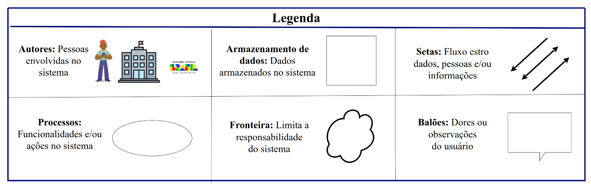

# Rich Picture

##  Introdução
As Rich Pictures são representações visuais que ilustram os principais elementos de uma situação e seus relacionamentos. Elas podem ser utilizadas tanto para apoiar a compreensão de um contexto quanto para identificar pontos de melhoria. Na prática, consistem em uma combinação de imagens, textos, símbolos e ícones organizados de forma integrada.

No caso do HBO Max, a Rich Picture representa a plataforma, suas principais funcionalidades e a forma como os usuários interagem com seus recursos.

## Metodologia e Ferramentas
A ferramenta Draw.io foi fundamental para a elaboração de elementos visuais-chave do projeto. Com ela, criamos o Rich Picture e sua legenda correspondente. Esses diagramas, mostrados na Figura 1 e Figura 2, são essenciais para uma visão completa do escopo e do contexto do nosso trabalho.

Figura 1: Richpicture versão 1.

Fonte:  [Camila Silva](https://github.com/CamilaSilvaC), [Geovanna Alves](https://github.com/GeovannaUmbelino), [Luísa de Souza](https://github.com/luisa12ll)  e [Yan Matheus](https://github.com/Yanmatheus0812).

### Legenda 

A construção das Rich Pictures foi elaborada com base em cinco elementos principais, conforme destacado por Revadi (2018, p. 4): atores, operações, armazenamentos de dados, setas e o limite do sistema. Esses elementos, essenciais para a representação do contexto do projeto, podem ser observados na *Imagem 2*

Figura 1: Legenda versão 1.

Fonte:  [Camila Silva](https://github.com/CamilaSilvaC), [Geovanna Alves](https://github.com/GeovannaUmbelino), [Luísa de Souza](https://github.com/luisa12ll)  e [Yan Matheus](https://github.com/Yanmatheus0812).

## Histórico de Versões

| Versão | Data       | Descrição                   | Autor             | Revisor         |
|--------|------------|-----------------------------|-------------------|-----------------|
| 1.0    | 07/09/2025 | Adicionando o Rich Picture  | [Geovanna Alves](https://github.com/GeovannaUmbelino)   |  [Pedro Henrique](https://github.com/pedrohpsantos)  | |
| 1.1   | 16/09/2025 | Atualizando as legendas das imagens  |  [Camila Silva](https://github.com/CamilaSilvaC) e [Geovanna Alves](https://github.com/GeovannaUmbelino) | [Luísa de Souza](https://github.com/luisa12ll)  |
