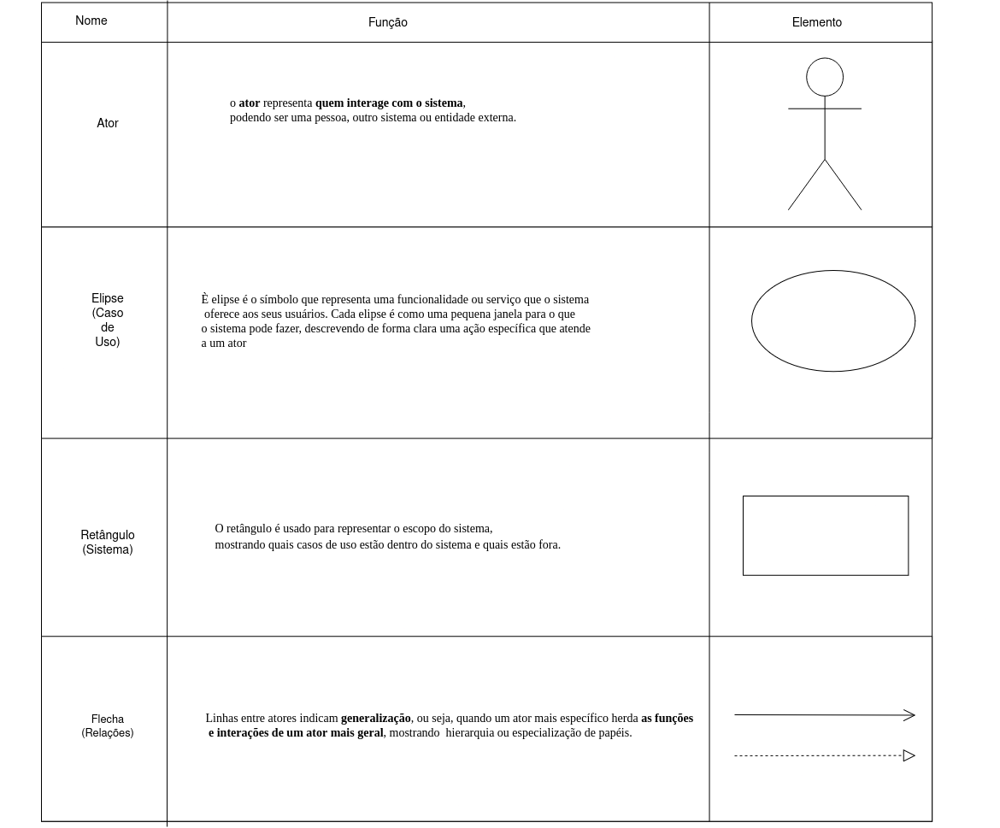
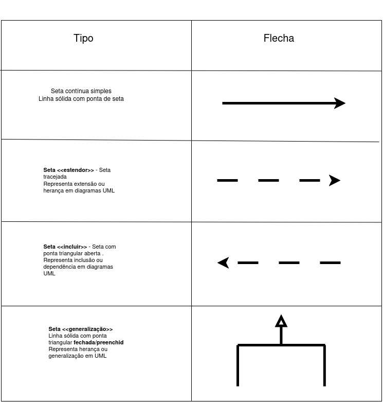
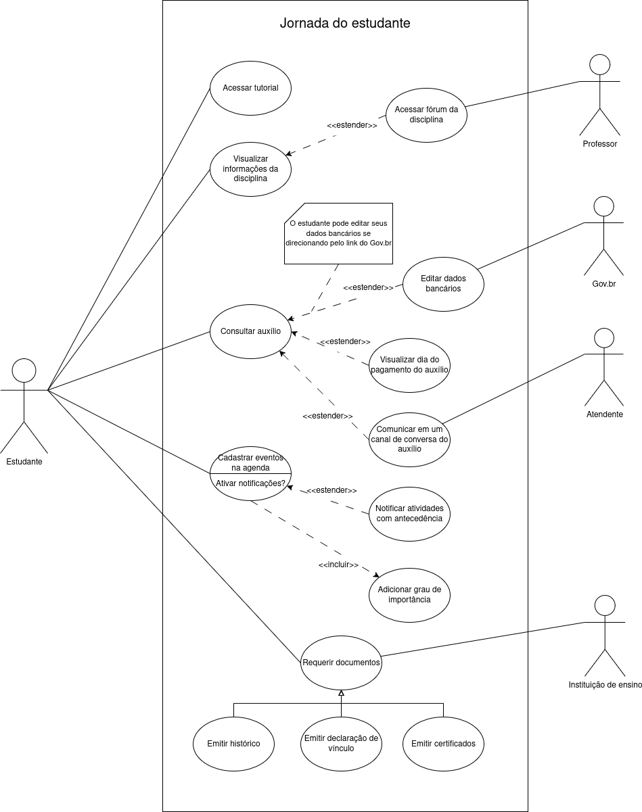

# Casos de Uso

## Introdução

Um caso de uso se refere a uma descrição detalhada de como o sistema será utilizado em uma determinada situação ou contexto. Ele descreve as interações entre os estudantes e o sistema, apresentando os passos necessários para alcançar um objetivo específico<a id="anchor_1" href="#FRM1">[1]</a>.
O objetivo dos casos de uso é auxiliar no processo de desenvolvimento de um sistema, fornecendo uma visão clara dos requisitos funcionais do sistema, descrevendo as ações que os estudantes podem realizar e as respostas do sistema a ações.

## Participantes

A seguir temos a tabela 1, onde indica todos os participantes do caso de uso, o horário e local da aplicação da técnica.

  <table border="1" cellspacing="0" cellpadding="5">
    <thead>
      <tr>
        <th>Nome</th>
        <th>quais etapas participou</th>
        <th>Data</th>
      </tr>
    </thead>
    <tbody>
      <tr>
        <td><a href="https://github.com/CamilaSilvaC">Camila Silva</a></td>
        <td>Elaborou os casos de uso: <a href="https://requisitos-de-software.github.io/2025.2-Grupo05/Modelagem/Casos-de-uso/#:~:text=e%20Geovanna%20Alves-,UC02,-Informa%C3%A7%C3%B5es">UC02, <a href="https://requisitos-de-software.github.io/2025.2-Grupo05/Modelagem/Casos-de-uso/#:~:text=Luisa%20de%20Souza-,UC03,-Informa%C3%A7%C3%B5es">UC03 e <a href="https://requisitos-de-software.github.io/2025.2-Grupo05/Modelagem/Casos-de-uso/#:~:text=Fonte%3A%20Camila%20Silva-,UC04,-Informa%C3%A7%C3%B5es">UC04  </td>
        <td>09/10/2025</td>
      </tr>
      <tr>
        <td><a href="https://github.com/GeovannaUmbeliino">Geovanna Alves</a></td>
        <td>Elaborou os  casos de uso: <a href="https://requisitos-de-software.github.io/2025.2-Grupo05/Modelagem/Casos-de-uso/#:~:text=casos%20de%20uso.-,UC01,-Informa%C3%A7%C3%B5es">UC01, <a href="https://requisitos-de-software.github.io/2025.2-Grupo05/Modelagem/Casos-de-uso/#:~:text=Fonte%3A%20Yan%20Matheus-,UC08,-Informa%C3%A7%C3%B5es">UC08 e <a href="https://requisitos-de-software.github.io/2025.2-Grupo05/Modelagem/Casos-de-uso/#:~:text=Fonte%3A%20Geovanna%20Alves-,UC09,-Informa%C3%A7%C3%B5es">UC09 </td>
        <td>09/10/2025</td>
      </tr>
      <tr>
        <td><a href="https://github.com/mel14-hub">Lara Souza</a></td>
        <td>Elaborou os casos de uso: <a href="https://requisitos-de-software.github.io/2025.2-Grupo05/Modelagem/Casos-de-uso/#:~:text=Fonte%3A%20Pedro%20Henrique-,UC012,-Informa%C3%A7%C3%B5es">UC012 e <a href="https://requisitos-de-software.github.io/2025.2-Grupo05/Modelagem/Casos-de-uso/#:~:text=e%20Yan%20Matheus-,UC014,-Informa%C3%A7%C3%B5es">UC014  </td>
        <td>09/10/2025</td>
      </tr>
      <tr>
        <td><a href="https://github.com/luisa12ll">Luisa de Souza</a></td>
        <td>Elaborou os casos de uso: <a href="https://requisitos-de-software.github.io/2025.2-Grupo05/Modelagem/Casos-de-uso/#:~:text=casos%20de%20uso.-,UC01,-Informa%C3%A7%C3%B5es">UC01,  <a href="https://requisitos-de-software.github.io/2025.2-Grupo05/Modelagem/Casos-de-uso/#:~:text=e%20Geovanna%20Alves-,UC02,-Informa%C3%A7%C3%B5es">UC02, <a href="https://requisitos-de-software.github.io/2025.2-Grupo05/Modelagem/Casos-de-uso/#:~:text=Fonte%3A%20Camila%20Silva-,UC05,-Informa%C3%A7%C3%B5es">UC05 e  <a href="https://requisitos-de-software.github.io/2025.2-Grupo05/Modelagem/Casos-de-uso/#:~:text=Luisa%20de%20Souza-,UC06,-Informa%C3%A7%C3%B5es">UC06 </td>
        <td>09/10/2025</td>
      </tr>
      <tr>
        <td><a href="https://github.com/pedrohpsantos">Pedro Henrique</a></td>
        <td>Elaborou os casos de uso: <a href="https://requisitos-de-software.github.io/2025.2-Grupo05/Modelagem/Casos-de-uso/#:~:text=Fonte%3A%20Geovanna%20Alves-,UC010,-Informa%C3%A7%C3%B5es">UC010, <a href="https://requisitos-de-software.github.io/2025.2-Grupo05/Modelagem/Casos-de-uso/#:~:text=Fonte%3A%20Pedro%20Henrique-,UC011,-Informa%C3%A7%C3%B5es">UC011 e <a href="https://requisitos-de-software.github.io/2025.2-Grupo05/Modelagem/Casos-de-uso/#:~:text=e%20Yan%20Matheus-,UC013,-Informa%C3%A7%C3%B5es">UC013  </td>
        <td>09/10/2025</td>
      </tr>
      <tr>
        <td><a href="https://github.com/Yanmatheus0812">Yan Matheus</a></td>
        <td>Elaborou os casos de uso: <a href="https://requisitos-de-software.github.io/2025.2-Grupo05/Modelagem/Casos-de-uso/#:~:text=Luisa%20de%20Souza-,UC07,-Informa%C3%A7%C3%B5es">UC07, <a href="https://requisitos-de-software.github.io/2025.2-Grupo05/Modelagem/Casos-de-uso/#:~:text=Fonte%3A%20Pedro%20Henrique-,UC012,-Informa%C3%A7%C3%B5es">UC012 e <a href="https://requisitos-de-software.github.io/2025.2-Grupo05/Modelagem/Casos-de-uso/#:~:text=e%20Yan%20Matheus-,UC014,-Informa%C3%A7%C3%B5es">UC014 </td>
        <td>09/10/2025</td>
      </tr>
    </tbody>
  </table>

Tabela 1: Participantes Casos de uso

Autor: <a href="https://github.com/Yanmatheus0812">Yan Matheus</a>

## Metodologia

<b>Figura 1</b>: Elementos do diagrama de casos de uso

Fonte: Fonte: [Lara Souza](https://github.com/mel14-hub) e [Pedro Henrique](https://github.com/pedrohpsantos)

<b>Figura 2</b>: Elementos das relações do diagrama de casos de uso

Fonte: [Lara Souza](https://github.com/mel14-hub) e [Pedro Henrique](https://github.com/pedrohpsantos)

## Diagrama de Casos de Uso

A figura 3 demonstra o diagrama de casos de uso.

<b>Figura 3</b>: Casos de uso do app Jornada do estudante

Fonte: [Lara Souza](https://github.com/mel14-hub), [Pedro Henrique](https://github.com/pedrohpsantos), [Yan Matheus](https://github.com/Yanmatheus0812), [Geovanna Alves](https://github.com/GeovannaUmbelino), [Luisa de Souza](https://github.com/Luisa12ll) e [Camila Silva](https://github.com/CamilaSilvaC)

## Especialização dos casos de uso

As tabelas de 2 a 15 apresentam a especialização dos casos de uso.

| UC01              | Informações                                                                                                 |
| ----------------- | ----------------------------------------------------------------------------------------------------------- |
| Descrição         | O estudante pode acessar um tutorial em vídeo demonstrando as funcionalidades do aplicativo                 |
| Atores envolvidos | Estudante (primário)                                                                                        |
| Ação              | O estudante acessa o tutorial do aplicativo                                                                 |
| Fluxo principal   | entrar no aplicativo > acessar o tutorial em vídeo                                                          |
| Relacionamentos   | Associação com estudante                                                                                    |
| Data de Criação   | 09/10/2025                                                                                                  |
| Rastreabilidade   | [RQ53](https://requisitos-de-software.github.io/2025.2-Grupo05/Elicita%C3%A7%C3%A3o/Requisitos-Elicitados/#:~:text=Question%C3%A1rio-,RQ53,-O%20aplicativo%20deve) |

Tabela 2: Acessar tutorial

Fonte: [Luisa de Souza](https://github.com/Luisa12ll) e [Geovanna Alves](https://github.com/GeovannaUmbelino)

| UC02              | Informações                                                                                                                                                                                                                                                                                                                                                                                                                                         |
| ----------------- | --------------------------------------------------------------------------------------------------------------------------------------------------------------------------------------------------------------------------------------------------------------------------------------------------------------------------------------------------------------------------------------------------------------------------------------------------- |
| Descrição         | O estudante pode visualizar informações da disciplina como notas, horários e professor responsável                                                                                                                                                                                                                                                                                                                                                  |
| Atores envolvidos | Estudante (primário) e professor (secundário)                                                                                                                                                                                                                                                                                                                                                                                                       |
| Ação              | O estudante visualiza informações da disciplinas                                                                                                                                                                                                                                                                                                                                                                                                    |
| Fluxo principal   | entrar no aplicativo > acessar a página da disciplina                                                                                                                                                                                                                                                                                                                                                                                               |
| Relacionamentos   | Associação com estudante e extensão para "Acessar fórum da disciplina"                                                                                                                                                                                                                                                                                                                                                                              |
| Data de Criação   | 09/10/2025                                                                                                                                                                                                                                                                                                                                                                                                                                          |
| Rastreabilidade   | [RQ17](https://requisitos-de-software.github.io/2025.2-Grupo05/Elicita%C3%A7%C3%A3o/Requisitos-Elicitados/#:~:text=de%20documenta%C3%A7%C3%A3o%20(ADD019)-,RQ17,-O%20aplicativo%20deve), [RQ18](<https://requisitos-de-software.github.io/2025.2-Grupo05/Elicita%C3%A7%C3%A3o/Requisitos-Elicitados/#:~:text=B01)%0ABrainstorming%20(B03)-,RQ18,-O%20aplicativo%20deve>), [RQ19](<https://requisitos-de-software.github.io/2025.2-Grupo05/Elicita%C3%A7%C3%A3o/Requisitos-Elicitados/#:~:text=E02)%0ABrainstorming(B02)-,RQ19,-O%20aplicativo%20deve>) e [RQ20](<https://requisitos-de-software.github.io/2025.2-Grupo05/Elicita%C3%A7%C3%A3o/Requisitos-Elicitados/#:~:text=Q11)%0ABrainstorming(B04)-,RQ20,-O%20aplicativo%20deve>) |

Tabela 3: Visualizar informações da disciplina

Fonte: [Camila Silva](https://github.com/CamilaSilvaC) e [Luisa de Souza](https://github.com/Luisa12ll)

| UC03              | Informações                                                                                                 |
| ----------------- | ----------------------------------------------------------------------------------------------------------- |
| Descrição         | O estudante pode acessar o fórum da disciplina para ter um contato direto com o professor                   |
| Atores envolvidos | Estudante (primário) e professor (secundário)                                                               |
| Ação              | O estudante acessa o fórum da disciplina para falar com o professor                                         |
| Fluxo principal   | entrar no aplicativo > acessar a página da disciplina > acessar fórum da disciplina                         |
| Relacionamentos   | Extensão de "Visualizar informações da disciplina" e associação com professor                               |
| Data de Criação   | 09/10/2025                                                                                                  |
| Rastreabilidade   | [RQ57](https://requisitos-de-software.github.io/2025.2-Grupo05/Elicita%C3%A7%C3%A3o/Requisitos-Elicitados/#:~:text=Brainstorming-,RQ57,-O%20aplicativo%20deve) |

Tabela 4: Acessar fórum da disciplina

Fonte: [Camila Silva](https://github.com/CamilaSilvaC)

| UC04              | Informações                                                                                                                                                                                                                                                                                                                         |
| ----------------- | ----------------------------------------------------------------------------------------------------------------------------------------------------------------------------------------------------------------------------------------------------------------------------------------------------------------------------------- |
| Descrição         | O estudante pode consultar a página de auxílio para verificar informações                                                                                                                                                                                                                                                           |
| Atores envolvidos | Estudante (primário)                                                                                                                                                                                                                                                                                                                |
| Ação              | O estudante acessa a página do auxílio                                                                                                                                                                                                                                                                                              |
| Fluxo principal   | entrar no aplicativo > acessar a página do auxílio                                                                                                                                                                                                                                                                                  |
| Relacionamentos   | Asociação com aluno e extensões com "Editar dados bancários", "Visualizar dia do pagamento do auxílio" e "Comunicar em um canal de conversa do auxílio"                                                                                                                                                                             |
| Data de Criação   | 09/10/2025                                                                                                                                                                                                                                                                                                                          |
| Rastreabilidade   | [RQ31](<https://requisitos-de-software.github.io/2025.2-Grupo05/Elicita%C3%A7%C3%A3o/Requisitos-Elicitados/#:~:text=Q21)%0ABrainstorming(B018)-,RQ31,-O%20aplicativo%20deve>), [RQ32](<https://requisitos-de-software.github.io/2025.2-Grupo05/Elicita%C3%A7%C3%A3o/Requisitos-Elicitados/#:~:text=E018)%0AQuestion%C3%A1rio%20(Q22)-,RQ32,-O%20aplicativo%20deve>) e [RQ33](https://requisitos-de-software.github.io/2025.2-Grupo05/Elicita%C3%A7%C3%A3o/Requisitos-Elicitados/#:~:text=2%2C%20Question%C3%A1rio-,RQ33,-O%20aplicativo%20deve) |

Tabela 5: Consultar auxílio

Fonte: [Camila Silva](https://github.com/CamilaSilvaC)

| UC05              | Informações                                                                                                                                                                                                                                                                                                                         |
| ----------------- | ----------------------------------------------------------------------------------------------------------------------------------------------------------------------------------------------------------------------------------------------------------------------------------------------------------------------------------- |
| Descrição         | O estudante pode editar seus dados bancários do recebimento do auxílio pelo Gov.br                                                                                                                                                                                                                                                  |
| Atores envolvidos | Estudante (primário) e Gov.br (secundário)                                                                                                                                                                                                                                                                                          |
| Ação              | O estudante edita suas informações bancárias acessando um link do Gov.br                                                                                                                                                                                                                                                            |
| Fluxo principal   | entrar no aplicativo > acessar a página do auxílio > Editar informações bancárias > Gov.br                                                                                                                                                                                                                                          |
| Relacionamentos   | Asociação com Gov.br e extensão de "Consultar auxílio"                                                                                                                                                                                                                                                                              |
| Data de Criação   | 09/10/2025                                                                                                                                                                                                                                                                                                                          |
| Rastreabilidade   |  [RQ31](<https://requisitos-de-software.github.io/2025.2-Grupo05/Elicita%C3%A7%C3%A3o/Requisitos-Elicitados/#:~:text=Q21)%0ABrainstorming(B018)-,RQ31,-O%20aplicativo%20deve>), [RQ32](<https://requisitos-de-software.github.io/2025.2-Grupo05/Elicita%C3%A7%C3%A3o/Requisitos-Elicitados/#:~:text=E018)%0AQuestion%C3%A1rio%20(Q22)-,RQ32,-O%20aplicativo%20deve>) e [RQ33](https://requisitos-de-software.github.io/2025.2-Grupo05/Elicita%C3%A7%C3%A3o/Requisitos-Elicitados/#:~:text=2%2C%20Question%C3%A1rio-,RQ33,-O%20aplicativo%20deve)|

Tabela 6: Editar dados bancários

Fonte: [Luisa de Souza](https://github.com/Luisa12ll)

| UC06              | Informações                                                                                                 |
| ----------------- | ----------------------------------------------------------------------------------------------------------- |
| Descrição         | O estudante pode visualizar o dia do pagamento do auxílio                                                   |
| Atores envolvidos | Estudante (primário)                                                                                        |
| Ação              | O estudante visualiza o dia do pagamento do auxílio                                                         |
| Fluxo principal   | entrar no aplicativo > acessar a página do auxílio > Visualizar dia do pagamento                            |
| Relacionamentos   | Extensão de "Consultar auxílio"                                                                             |
| Data de Criação   | 09/10/2025                                                                                                  |
| Rastreabilidade   | [RQ34](https://requisitos-de-software.github.io/2025.2-Grupo05/Elicita%C3%A7%C3%A3o/Requisitos-Elicitados/#:~:text=2%2C%20Question%C3%A1rio-,RQ34,-O%20aplicativo%20deve) |

Tabela 7: Visualizar dia do pagamento do auxílio

Fonte: [Luisa de Souza](https://github.com/Luisa12ll)

| UC07              | Informações                                                                                                 |
| ----------------- | ----------------------------------------------------------------------------------------------------------- |
| Descrição         | O estudante pode tirar dúvidas sobre o auxílio em um canal de conversa                                      |
| Atores envolvidos | Estudante (primário) e atendente (secundário)                                                               |
| Ação              | O estudante se comunica através de um canal com um atendente                                                |
| Fluxo principal   | entrar no aplicativo > acessar a página do auxílio > Falar com um atendente                                 |
| Relacionamentos   | Extensão de "Consultar auxílio" e associação com Atendente                                                  |
| Data de Criação   | 09/10/2025                                                                                                  |
| Rastreabilidade   | [RQ35](https://requisitos-de-software.github.io/2025.2-Grupo05/Elicita%C3%A7%C3%A3o/Requisitos-Elicitados/#:~:text=2%2C%20Question%C3%A1rio-,RQ35,-O%20aplicativo%20deve) |

Tabela 8: Comunicar em um canal de conversa do auxílio

Fonte: [Yan Matheus](https://github.com/Yanmatheus0812)

| UC08              | Informações                                                                                                                                                                                                                                                                                                                            |
| ----------------- | -------------------------------------------------------------------------------------------------------------------------------------------------------------------------------------------------------------------------------------------------------------------------------------------------------------------------------------- |
| Descrição         | O estudante pode criar, editar e excluir eventos na agenda                                                                                                                                                                                                                                                                             |
| Atores envolvidos | Estudante (primário)                                                                                                                                                                                                                                                                                                                   |
| Ação              | O estudante cadastra eventos na agenda, podendo edita-los e exclui-los                                                                                                                                                                                                                                                                 |
| Fluxo principal   | entrar no aplicativo > Agenda                                                                                                                                                                                                                                                                                                          |
| Relacionamentos   | Associação de Estudante, extensão para "Notificar atividades acadêmicas" e inclusão para "Adicionar grau de importância"                                                                                                                                                                                                               |
| Data de Criação   | 09/10/2025                                                                                                                                                                                                                                                                                                                             |
| Rastreabilidade   | [RQ45](https://requisitos-de-software.github.io/2025.2-Grupo05/Elicita%C3%A7%C3%A3o/Requisitos-Elicitados/#:~:text=Entrevista%203-,RQ45,-O%20aplicativo%20deve), [RQ46](https://requisitos-de-software.github.io/2025.2-Grupo05/Elicita%C3%A7%C3%A3o/Requisitos-Elicitados/#:~:text=Question%C3%A1rio-,RQ46,-A%20agenda%20deve) e [RQ47](https://requisitos-de-software.github.io/2025.2-Grupo05/Elicita%C3%A7%C3%A3o/Requisitos-Elicitados/#:~:text=Question%C3%A1rio-,RQ47,-A%20agenda%20deve) |

Tabela 9: Cadastrar eventos na agenda 

Fonte: [Geovanna Alves](https://github.com/GeovannaUmbelino)

| UC09              | Informações                                                                                                 |
| ----------------- | ----------------------------------------------------------------------------------------------------------- |
| Descrição         | O estudante pode receber notificações de atividades cadastradas na agenda                                   |
| Atores envolvidos | Estudante (primário)                                                                                        |
| Ação              | O estudante ativa as notificações ao criar o evento na agenda                                               |
| Fluxo principal   | entrar no aplicativo > Agenda > Criar/Editar evento > Ativar notificações?                                  |
| Relacionamentos   | Extensão de "Cadastrar eventos na agenda"                                                                   |
| Data de Criação   | 09/10/2025                                                                                                  |
| Rastreabilidade   | [RQ49](https://requisitos-de-software.github.io/2025.2-Grupo05/Elicita%C3%A7%C3%A3o/Requisitos-Elicitados/#:~:text=Question%C3%A1rio-,RQ49,-A%20agenda%20deve) |

Tabela 10: Notificar atividades com antecedência 

Fonte: [Geovanna Alves](https://github.com/GeovannaUmbelino)

| UC010             | Informações                                                                                                 |
| ----------------- | ----------------------------------------------------------------------------------------------------------- |
| Descrição         | O estudante seleciona o grau de importância à atribuir para o evento criado na agenda                       |
| Atores envolvidos | Estudante (primário)                                                                                        |
| Ação              | O estudante seleciona a importância da atividade criada                                                     |
| Fluxo principal   | entrar no aplicativo > Agenda > Criar/Editar evento > Importância do evento                                 |
| Relacionamentos   | Inclusão de "Cadastrar eventos na agenda"                                                                   |
| Data de Criação   | 09/10/2025                                                                                                  |
| Rastreabilidade   | [RQ51](https://requisitos-de-software.github.io/2025.2-Grupo05/Elicita%C3%A7%C3%A3o/Requisitos-Elicitados/#:~:text=Question%C3%A1rio-,RQ51,-A%20agenda%20deve) |

Tabela 11: Adicionar grau de importância 

Fonte: [Pedro Henrique](https://github.com/pedrohpsantos)

| UC011             | Informações                                                                                                                                                                                                                                                                                                                            |
| ----------------- | -------------------------------------------------------------------------------------------------------------------------------------------------------------------------------------------------------------------------------------------------------------------------------------------------------------------------------------- |
| Descrição         | O estudante pode requerir documentos da instituição de ensino                                                                                                                                                                                                                                                                          |
| Atores envolvidos | Estudante (primário) e Instituição de ensino (secundário)                                                                                                                                                                                                                                                                              |
| Ação              | O estudante requere documentos para sua instituição de ensino                                                                                                                                                                                                                                                                          |
| Fluxo principal   | entrar no aplicativo > Emitir documentos                                                                                                                                                                                                                                                                                               |
| Relacionamentos   | Associação de estudante, associação de instituição de ensino e generalização para "Emitir histórico", "Emitir declaração de vínculo" e "Emitir certificados"                                                                                                                                                                           |
| Data de Criação   | 09/10/2025                                                                                                                                                                                                                                                                                                                             |
| Rastreabilidade   | [RQ27](<https://requisitos-de-software.github.io/2025.2-Grupo05/Elicita%C3%A7%C3%A3o/Requisitos-Elicitados/#:~:text=Q17)%0ABrainstorming(B014)-,RQ27,-O%20aplicativo%20deve>)), [RQ28](<https://requisitos-de-software.github.io/2025.2-Grupo05/Elicita%C3%A7%C3%A3o/Requisitos-Elicitados/#:~:text=Q18)%0ABrainstorming(B015)-,RQ28,-O%20aplicativo%20deve>) e [RQ60](https://requisitos-de-software.github.io/2025.2-Grupo05/Elicita%C3%A7%C3%A3o/Requisitos-Elicitados/#:~:text=Brainstorming-,RQ60,-O%20aplicativo%20deve) |

Tabela 12: Requerir documentos 

Fonte: [Pedro Henrique](https://github.com/pedrohpsantos)

| UC012             | Informações                                                                                                 |
| ----------------- | ----------------------------------------------------------------------------------------------------------- |
| Descrição         | O estudante pode requerir seu histórico da instituição de ensino                                            |
| Atores envolvidos | Estudante (primário) e Instituição de ensino (secundário)                                                   |
| Ação              | O estudante requere seu histórico para sua instituição de ensino                                            |
| Fluxo principal   | entrar no aplicativo > Emitir documentos > Emtiir histórico escolar                                         |
| Relacionamentos   | Generalização de "Requerir documentos"                                                                      |
| Data de Criação   | 09/10/2025                                                                                                  |
| Rastreabilidade   | [RQ28](<https://requisitos-de-software.github.io/2025.2-Grupo05/Elicita%C3%A7%C3%A3o/Requisitos-Elicitados/#:~:text=Q18)%0ABrainstorming(B015)-,RQ28,-O%20aplicativo%20deve>) |

Tabela 13: Emitir histórico 

Fonte: [Lara Souza](https://github.com/mel14-hub) e [Yan Matheus](https://github.com/Yanmatheus0812)

| UC013             | Informações                                                                                                 |
| ----------------- | ----------------------------------------------------------------------------------------------------------- |
| Descrição         | O estudante pode requerir sua declaração de vínculo da instituição de ensino                                |
| Atores envolvidos | Estudante (primário) e Instituição de ensino (secundário)                                                   |
| Ação              | O estudante requere sua declaração de vínculo para sua instituição de ensino                                |
| Fluxo principal   | entrar no aplicativo > Emitir documentos > Emtiir declaração de vínculo                                     |
| Relacionamentos   | Generalização de "Requerir documentos"                                                                      |
| Data de Criação   | 09/10/2025                                                                                                  |
| Rastreabilidade   | [RQ27](<https://requisitos-de-software.github.io/2025.2-Grupo05/Elicita%C3%A7%C3%A3o/Requisitos-Elicitados/#:~:text=Q17)%0ABrainstorming(B014)-,RQ27,-O%20aplicativo%20deve>) |

Tabela 14: Emitir declaração de vínculo 

Fonte: [Pedro Henrique](https://github.com/pedrohpsantos) e [Yan Matheus](https://github.com/Yanmatheus0812)

| UC014             | Informações                                                                                                 |
| ----------------- | ----------------------------------------------------------------------------------------------------------- |
| Descrição         | O estudante pode requerir seus certificados da instituição de ensino                                        |
| Atores envolvidos | Estudante (primário) e Instituição de ensino (secundário)                                                   |
| Ação              | O estudante requere seus certificados para sua instituição de ensino                                        |
| Fluxo principal   | entrar no aplicativo > Emitir documentos > Emtiir certificados                                              |
| Relacionamentos   | Generalização de "Requerir documentos"                                                                      |
| Data de Criação   | 09/10/2025                                                                                                  |
| Rastreabilidade   | [RQ60](https://requisitos-de-software.github.io/2025.2-Grupo05/Elicita%C3%A7%C3%A3o/Requisitos-Elicitados/#:~:text=Brainstorming-,RQ60,-O%20aplicativo%20deve) |

Tabela 15: Emitir certificados 

Fonte: [Lara Souza](https://github.com/mel14-hub) e [Yan Matheus](https://github.com/Yanmatheus0812)

## Gravação

### Participantes 1

A seguir temos a tabela 16, onde indica todos os participantes da sessão do caso de uso, o horário e local da aplicação da técnica.

  <table>
    <thead>
      <tr>
        <th>Nome</th>
        <th>Data</th>
      </tr>
    </thead>
    <tbody>
      <tr>
        <td><a href="https://github.com/CamilaSilvaC">Camila Silva</a></td>
        <td>09/10/2025</td>
         </tr>
      <tr>
      <tr>
        <td><a href="https://github.com/GeovannaUmbelino">Geovanna Alves</a></td>
         <td>09/10/2025</td>
      </tr>
      <tr>
        <td><a href="https://github.com/mel14-hub">Lara Souza</a></td>
        <td>09/10/2025</td>
      </tr>
      <tr>
        <td><a href="https://github.com/luisa12ll">Luísa de Souza</a></td>
        <td>09/10/2025</td>
      </tr>
      <tr>
        <td><a href="https://github.com/pedrohpsantos">Pedro Henrique</a></td>
         <td>09/10/2025</td>
      </tr>
      <tr>
        <td><a href="https://github.com/Yanmatheus0812">Yan Matheus</a></td>
         <td>09/10/2025</td>
      </tr>
    </tbody>
  </table>

Tabela 16: Participantes Casos de uso

Autor: <a href="https://github.com/Yanmatheus0812">Yan Matheus</a>

### Video 1

<iframe width="560" height="315" src="https://www.youtube.com/embed/WucrkTl8UE0?si=ZKRy98nzMAfoCrf5" title="YouTube video player" frameborder="0" allow="accelerometer; autoplay; clipboard-write; encrypted-media; gyroscope; picture-in-picture; web-share" referrerpolicy="strict-origin-when-cross-origin" allowfullscreen></iframe>

## Validação - Caso de uso

### Participantes 2

A seguir temos a tabela 17, onde indica todos os participantes da validação da técnica, o horário e local da aplicação da técnica. O estudante corresponde ao perfil de estudante 2

  <table>
    <thead>
      <tr>
        <th>Papel</th>
        <th>Nome</th>
        <th>Data</th>
        <th>Hora</th>
        <th>Local</th>
      </tr>
    </thead>
    <tbody>
      <tr>
        <td>Mediador</td>
        <td><a href="https://github.com/Yanmatheus0812)">Yan Matheus</a></td>
        <td>10/10/2025</td>
        <td>18:30</td>
        <td>Faculdade de Ciências e Tecnologias em Engenharia – FCTE/UnB</td>
         </tr>
      <tr>
       <tr>
        <td>estudante</td>
        <td>Pedro Henrique</td>
         <td>10/10/2025</td>
        <td>18:30</td>
        <td>Faculdade de Ciências e Tecnologias em Engenharia – FCTE/UnB</td>
      </tr>
    </tbody>
  </table>

Tabela 17: Validação Caso de uso

Autor: <a href="https://github.com/luisa12ll">Luísa de Souza</a>

### Video 2

<iframe width="560" height="315" src="https://www.youtube.com/embed/mHScbBuDxsI?si=bq-b2UW7-_yEWmkk" title="YouTube video player" frameborder="0" allow="accelerometer; autoplay; clipboard-write; encrypted-media; gyroscope; picture-in-picture; web-share" referrerpolicy="strict-origin-when-cross-origin" allowfullscreen></iframe>

## Agradecimentos

  Queremos agradecer o <b>Gemini e ChatGPT</b>, ferramenta de Inteligência Artificial Generativa, pelo apoio durante o desenvolvimento deste projeto Jornada do Estudante. Sua ajuda foi essencial na revisão de textos, na organização das ideias e na pesquisa de conteúdos complementares que contribuíram para deixar nossa documentação mais clara e completa.

De acordo com o Código de Conduta da Sociedade Brasileira de Computação (SBC), destacamos que a ferramenta foi utilizada apenas como apoio técnico e linguístico.
Todo o conteúdo apresentado é de autoria do Grupo 05, que assume total responsabilidade por sua originalidade e precisão.

## Bibliografia

<a id="FRM1" href="#anchor_1">1.</a> Lucidchart. Diagrama de Caso de Uso UML. Disponível em: <<https://www.lucidchart.com/pages/pt/diagrama-de-caso-de-uso-uml>>. Acesso em: 14 maio 2023.

<a id="FRM2" href="#anchor_2">2.</a> BARBOSA, S. D. J.; SILVA, B. S. Interação Humano-Computador. Rio de Janeiro: Elsevier, 2011.

<a id="FRM3" href="#anchor_3">3.</a> Fernando, Sidney. Casos de uso. Repositório da disciplina de Requisitos de Software da Universidade de Brasília, 2023. Disponível em: [hhttps://requisitos-de-software.github.io/2023.1-BilheteriaDigital/modelagem/useCase/](https://requisitos-de-software.github.io/2023.1-BilheteriaDigital/modelagem/useCase/). Acesso em: 10 out. 2025

## Histórico de Versões

| Versão | Data       | Descrição                       | Autor                                                                                                                                                                                                                                                                                                     | Revisor                                               |
| ------ | ---------- | ------------------------------- | --------------------------------------------------------------------------------------------------------------------------------------------------------------------------------------------------------------------------------------------------------------------------------------------------------- | ----------------------------------------------------- |
| 1.0    | 10/10/2025 | Documentação dos do caso de uso | [Lara Souza](https://github.com/mel14-hub), [Pedro Henrique](https://github.com/pedrohpsantos), [Yan Matheus](https://github.com/Yanmatheus0812), [Geovanna Alves](https://github.com/GeovannaUmbelino), [Luisa de Souza](https://github.com/Luisa12ll) e [Camila Silva](https://github.com/CamilaSilvaC) | [Geovanna Alves](https://github.com/GeovannaUmbelino) |
| 1.1    | 20/10/2025 | Atualização da tabela           | [Pedro Henrique](https://github.com/pedrohpsantos)                                                                                                                                                                                                                                                        | [Lara Souza](https://github.com/mel14-hub)            |
