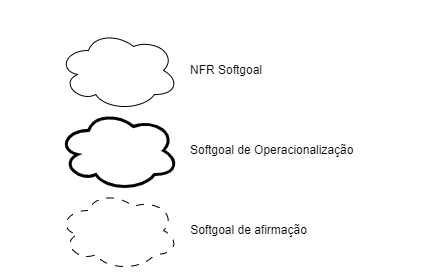
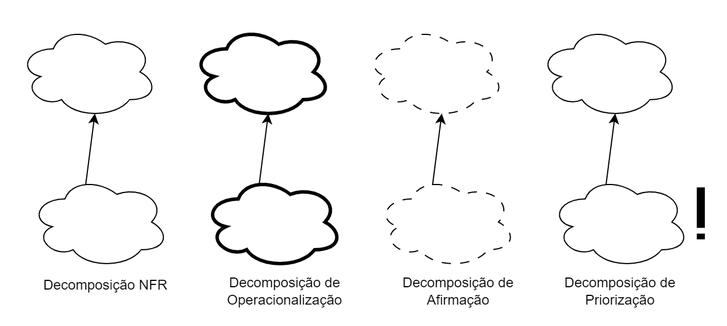
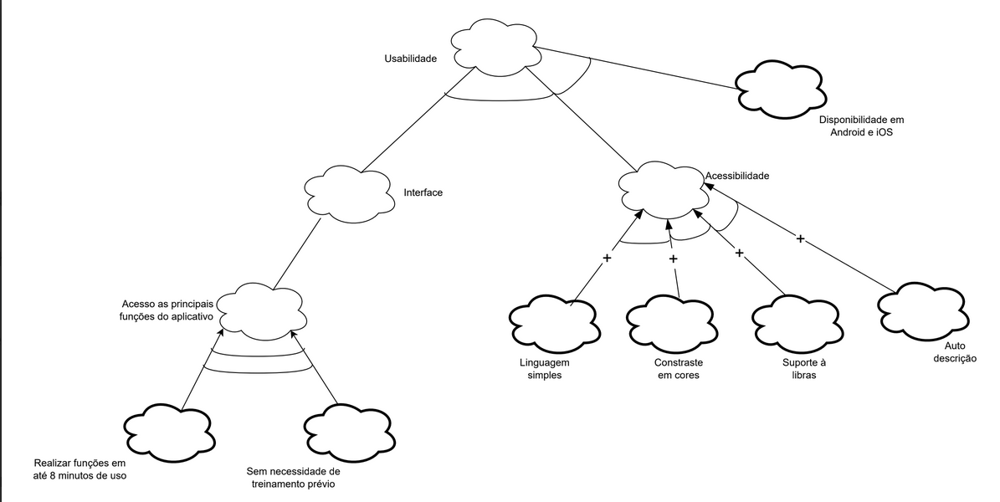
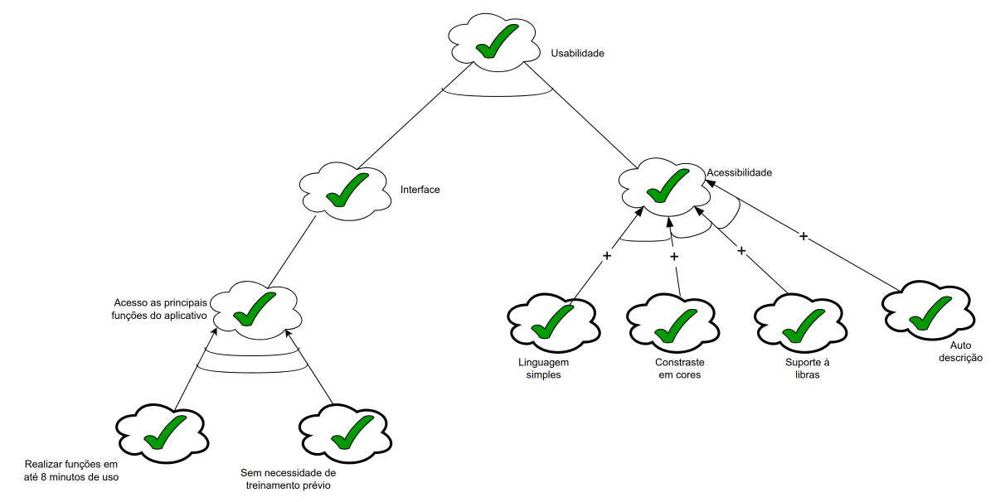
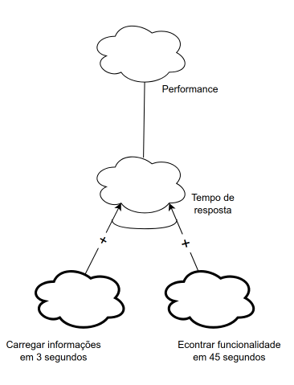
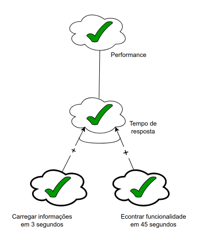
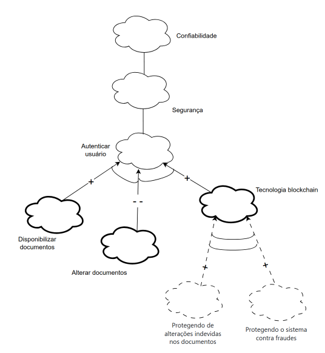
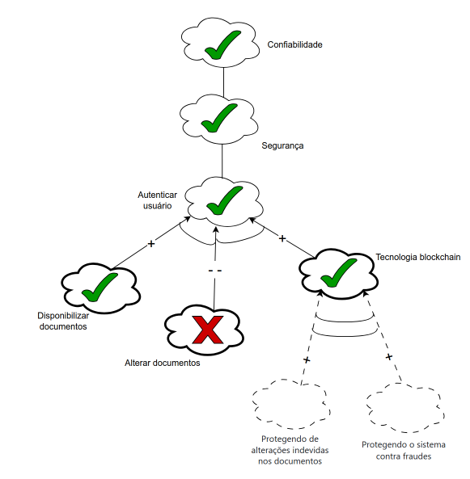

# NFR - Framework

## Introdução

Uma forma de representação e análise dos requisitos Não-Funcionais é o NFR Framework, o qual visa à implementação de resoluções particulares. Sendo assim, para tal, considera-se as características gerais do sistema em questão e de seu domínio. No NFR Framework, faz-se o uso do modelo de Softgoal Interdependency Graph (SIG).

## Participantes

A seguir temos a tabela 1, onde indica todos os participantes da elaboração dos cenários.

Tabela 1: Participantes

  <table border="1" cellspacing="0" cellpadding="5">
    <thead>
      <tr>
        <th>Nome</th>
        <th>quais etapas participou</th>
        <th>Data</th>
      </tr>
    </thead>
    <tbody>
      <tr>
        <td><a href="https://github.com/CamilaSilvaC">Camila Silva</a></td>
        <td>Elaborou o <a href="https://requisitos-de-software.github.io/2025.2-Grupo05/Modelagem/%C3%81gil/NFR-Framework/#:~:text=sem%20termos%20t%C3%A9cnicos).-,Rastreabilidade,RQ25,-Classifica%C3%A7%C3%A3o">Cartão de especificação do NFR25</a>  e colaborou na confecção do grafo SIG</td>
        <td>17/10/2025</td>
      </tr>
      <tr>
        <td><a href="https://github.com/GeovannaUmbeliino">Geovanna Alves</a></td>
        <td>Elaborou o <a href="https://requisitos-de-software.github.io/2025.2-Grupo05/Modelagem/%C3%81gil/NFR-Framework/#:~:text=at%C3%A9%2045%20segundos.-,Rastriabilidade,RQ54,-Classifica%C3%A7%C3%A3o">Cartão de especificação do NFR54</a> e colaborou na confecção do grafo SIG </td>
        <td>17/10/2025</td>
      </tr>
      <tr>
        <td><a href="https://github.com/mel14-hub">Lara Souza</a></td>
        <td>Elaborou o <a href="https://requisitos-de-software.github.io/2025.2-Grupo05/Modelagem/%C3%81gil/NFR-Framework/#:~:text=disponibiliza%C3%A7%C3%A3o%20de%20documentos.-,Rastriabilidade,RQ03,-Classifica%C3%A7%C3%A3o">Cartão de especificação do NFR03</a>  e colaborou na confecção do grafo SIG</td>
        <td>17/10/2025</td>
      </tr>
      <tr>
        <td><a href="https://github.com/luisa12ll">Luisa de Souza</a></td>
        <td>Elaborou o <a href="https://requisitos-de-software.github.io/2025.2-Grupo05/Modelagem/%C3%81gil/NFR-Framework/#:~:text=com%20defici%C3%AAncia%20visual.-,Rastreabilidade,RQ40,-Classifica%C3%A7%C3%A3o">Cartão de especificação do NFR40</a> e colaborou na confecção do grafo SIG</td>
        <td>17/10/2025</td>
      </tr>
      <tr>
        <td><a href="https://github.com/pedrohpsantos">Pedro Henrique</a></td>
        <td>Elaborou o <a href="https://requisitos-de-software.github.io/2025.2-Grupo05/Modelagem/%C3%81gil/NFR-Framework/#:~:text=de%20treinamento%20pr%C3%A9vio.-,Rastreabilidade,RQ24,-Classifica%C3%A7%C3%A3o">Cartão de especificação do NFR24</a> e colaborou na confecção do grafo SIG</td>
        <td>17/10/2025</td>
      </tr>
      <tr>
        <td><a href="https://github.com/Yanmatheus0812">Yan Matheus</a></td>
        <td>Elaborou o <a href="https://requisitos-de-software.github.io/2025.2-Grupo05/Modelagem/%C3%81gil/NFR-Framework/#:~:text=m%C3%A1ximo%203%20segundos.-,Rastreabilidade,RQ26,-Classifica%C3%A7%C3%A3o">Cartão de especificação do NFR26</a> e colaborou na confecção do grafo SIG</td>
        <td>17/10/2025</td>
      </tr>
    </tbody>
  </table>

 Autor: <a href="https://github.com/Yanmatheus0812"> Yan Matheus</a>

## Softgoal Interdependency Graph

O Softgoal Interdependency Graph (SIG) é uma forma de visualização do funcionamento do NFR Framework. Dessa forma, trata-se de um gráfico que registra os posicionamentos da equipe de desenvolvimento acerca dos softgoals e explicita suas interdependências de forma gráfica e concisa<a id="anchor_1" href="#REF1">[1]</a>.

### Tipos de Softgoal

Para a compreensão do SIG, é inexorável discernir a definição de NFR Softgoal: um objetivo que não é explicitamente definido e seus critérios de satisfação são imprecisos. Sendo assim, um softgoal é uma característica abstrata que está sujeita à vistoria, ou seja, postula-se posteriormente o destino de um determinado softgoal. Além disso, os softgoals podem ser operacionalizados, nesse caso, tomam uma forma concreta. Portanto, entende-se como funcionalidades. Por fim, há os softgoals de afirmação, os quais são escritos em linguagem natural e se tratam de registros adicionais e argumentativos, os quais podem ser incrementados ao modelo<a id="anchor_1" href="#REF1">[1]</a>. Os tipos de softgoal estão ilustrados na Figura 1.

<b>Figura 1</b> - Tipos de Softgoal

 Fonte: (SILVA, 2019)

### Interdependências

As interdependências são definições para as associações que ocorrem entre softgoals. Tais são divididas em decomposições e contribuições:

#### Decomposições

As decomposições podem ocorrer em todos os níveis de abstração: Softgoals de NFR, de Operacionalização e de Afirmação. Nas três primeiras decomposições, os softgoals são subdivididos em softgoals especificados (SILVA, 2019)<a id="anchor_1" href="#REF1">[1]</a>. Os quatro tipos estão explicitados na figura 2.

- Decomposição NFR: ajuda a dividir vicissitudes primordiais em partes menores, o que reduz as ambiguidades e facilita a priorização.
- Decomposição de Operacionalização: tem por finalidade refinar uma solução geral em soluções particulares.
- Decomposição de Afirmação: serve como afirmação ou negação de justificativas específicas do projeto.
- Decomposição de Priorização: trata-se de uma decomposição especial, na qual o softgoal é refinado em outro softgoal de mesmo tipo e tópico. No entanto, associa-se uma prioridade.

<b>Figura 2</b> - Tipos de Decomposição

</figure>

 Fonte: (SILVA, 2019)

#### Contribuições

Num NFR Framework, os softgoals se especializam cada vez mais. Por conseguinte, o um softgoal derivado de outro pode contribuir de forma integral ou truncada, e também de forma positiva ou negativa, para o softgoal do qual ele derivou. Portanto, listar-se-á os tipos de contribuição<a id="anchor_2" href="#REF2">[2]</a>:

- AND: se os softgoals derivados forem satisfeitos, o softgoal primordial também será.
- OR: se algum dos softgoals derivados forem satisfeitos, o softgoal primordial também será.
- MAKE(++): um softgoal originado contribui de forma plenamente positiva, logo o softgoal original também será satisfeito.
- BREAK(--): um softgoal originado contribui de forma plenamente negativa, logo o softgoal original será negado.
- HELP(+): um softgoal originado realiza uma contribuição restritamente positiva, o que reflete da mesma forma e na mesma intensidade no softgoal primordial.
- HURT(-): um softgoal originado realiza uma contribuição restritamente negativa, o que reflete da mesma forma e na mesma intensidade no softgoal primordial.
- UNKNOWN(?): contribuição incógnita.
- EQUALS: relação direta entre as satisfações do softgoal derivado e a do primordial.
- SOME: a forma de contribuição é conhecida, no entanto, a intensidade dessa contribuição é desconhecida.

#### Propagação de Impactos

A propagação de impactos no NFR Framework envolve a identificação das relações de dependência entre os requisitos não funcionais, bem como a análise de como uma mudança em um requisito pode afetar outros requisitos relacionados. Isso requer uma compreensão clara das interações entre os requisitos, bem como a capacidade de avaliar as prioridades e trade-offs entre eles. Ao considerar a propagação de impactos, os engenheiros de requisitos podem tomar decisões informadas sobre mudanças e gerenciar os possíveis efeitos colaterais de forma eficaz. A seguir são apresentados os tipos de softgoals de impacto e suas respectivas notações<a id="anchor_2" href="#REF2">[2]</a>:

- ✓ (satisfeito): Indica que um requisito não funcional contribui positivamente para a satisfação de outro requisito.
- 𝒲+ (fracamente satisfeito): ndica uma relação de impacto positiva, mas menos forte do que a notação ✓.
- X (negado): Indica que um requisito não funcional afeta negativamente outro requisito, negando ou contradizendo sua realização.
- 𝒲- (fracamente negado): Similar à notação X, mas com uma relação de negação mais fraca.
- 🗲 (conflitante): Indica uma relação de conflito entre requisitos não funcionais. Isso significa que os requisitos possuem características positivas e negativas.
- u (indeterminado): Uma relação indeterminada ou desconhecida entre requisitos não funcionais. Isso ocorre quando não há informações suficientes para determinar o impacto de um requisito em outro.

## Metodologia

Os frameworks foram separados por temas, esses temas foram divididos em três para limitar o escopo aqui trabalhado. Após isso, fez-se uma introspecção para a construção do SIG a partir dos tópicos gerais definidos, a fim de fazer relações com os Requisitos Não-Funcionais da Tabela 12, após isso, fez-se o uma revisão na literatura e foi feita a validação do SIG confeccionado. A plataforma utilizada para a elaboração foi o Draw.io.

## Requisitos Não-Funcionais

A Tabela 2 a seguir lista os Requisitos Não-Funcionais utilizados para a criação do NFR Framework.

| ID                                                                                                                                             | Descrição                                                                                                                                                                           |
| ---------------------------------------------------------------------------------------------------------------------------------------------- | ----------------------------------------------------------------------------------------------------------------------------------------------------------------------------------- |
| [RQ03](<https://requisitos-de-software.github.io/2025.2-Grupo05/Modelagem/Especificacao/#:~:text=Autor-,RQ3,-Confiabilidade%20(R)>)            | O aplicativo deve ter uma tecnologia blockchain que é usada para a autenticação e disponibilização de documentos.                                                                   |
| [RQ24](<https://requisitos-de-software.github.io/2025.2-Grupo05/Modelagem/Especificacao/#:~:text=Geovanna%20Alves-,RQ24,-Usabilidade%20(U)>)   | O estudante deve ser capaz de realizar as principais funções do aplicativo (cadastro, login, busca, e envio de dados) em até 8 minutos de uso, sem necessidade de treinamento prévio. |
| [RQ25](<https://requisitos-de-software.github.io/2025.2-Grupo05/Modelagem/Especificacao/#:~:text=Pedro%20Henrique-,RQ25,-Usabilidade%20(U)>)   | O aplicativo deve ter uma linguagem simples e adequada ao estudante (sem termos técnicos).                                                                                            |
| [RQ26](<https://requisitos-de-software.github.io/2025.2-Grupo05/Modelagem/Especificacao/#:~:text=Lara%20Souza-,RQ26,-Performance%20(P)>)       | O aplicativo deve carregar suas informações em no máximo 3 segundos.                                                                                                                |
| [RQ40](<https://requisitos-de-software.github.io/2025.2-Grupo05/Modelagem/Especificacao/#:~:text=Luisa%20de%20Souza-,RQ40,-Usabilidade%20(U)>) | O aplicativo deve ser acessível (contraste em cores, suporte à Libras e auto-descrição).                                                                                            |
| [RQ54](<https://requisitos-de-software.github.io/2025.2-Grupo05/Modelagem/Especificacao/#:~:text=Camila%20Silva-,RQ54,-Performance%20(P)>)     | O aplicativo deve ter a possibilidade de encontrar qualquer funcionalidade desejada em até 45 segundos.                                                                             |

<b>Tabela 2</b> - Requisitos Não-Funcionais 

Fonte: [Yan Matheus](https://github.com/Yanmatheus0812)

## Cartões de Especificação

Na tabela 3, está apresentado o cartão de especificação do Requisito Não Funcional (RNF) associados ao NFR Framework de Segurança, com foco na Tecnologia blockchain para autenticação e disponubilização de documentos.

| Itens                 | Descrição                                                                                                                                                           |
| --------------------- | ------------------------------------------------------------------------------------------------------------------------------------------------------------------- |
| RNF                   | O aplicativo deve ter uma tecnologia blockchain que é usada para a autenticação e disponibilização de documentos.                                                   |
| Rastriabilidade       | [RQ03](<https://requisitos-de-software.github.io/2025.2-Grupo05/Modelagem/Especificacao/#:~:text=Autor-,RQ3,-Confiabilidade%20(R)>)                                 |
| Classificação         | Segurança (S)                                                                                                                                                       |
| Descrição             | O requisito define que aplicativo deve ter tecnologia blockchain para autenticação e diponibilização de documentos ,garantindo ratreabiliade e segurança dos dados. |
| Justificativa         | O uso da tecnologia blockchain garante a segurança dos dados ,reduzindo a perda de dados.                                                                           |
| Critério de Aceitação | O sistema deve realizar autenticação e disponibilização de documentos via blockchain,em um tempo médio garantindo a integridade dos dados.                          |
| Dependências          | integração com serviços de blockchain, módulo de autenticação de estudantes, e infraestrutura de armazenamento de documentos.                                         |
| Prioridade            | Alta                                                                                                                                                                |
| Conflitos             | Nenhum                                                                                                                                                              |

Tabela 3: Tecnologia blockchain para autenticação e disponubilização de documentos 

Autor: <a href="https://github.com/mel14-hub">Lara Souza Mota</a>

Tabela 4, está apresentado o cartão de especificação do Requisito Não Funcional (RNF) associados ao NFR Framework de Usabilidade, com foco no tempo para realizar funções principais.

| Itens                 | Descrição                                                                                                                                                                                                                                             |
| --------------------- | ----------------------------------------------------------------------------------------------------------------------------------------------------------------------------------------------------------------------------------------------------- |
| RNF                   | O estudante deve ser capaz de realizar as principais funções do aplicativo (cadastro, login, busca, e envio de dados) em até 8 minutos de uso, sem necessidade de treinamento prévio.                                                                   |
| Rastreabilidade       | [RQ24](<https://requisitos-de-software.github.io/2025.2-Grupo05/Modelagem/Especificacao/#:~:text=Geovanna%20Alves-,RQ24,-Usabilidade%20(U)>)                                                                                                          |
| Classificação         | Usabilidade (U)                                                                                                                                                                                                                                       |
| Descrição             | O requisito estipula que um novo estudante deve conseguir executar as tarefas essenciais da aplicação — como se cadastrar, fazer login, buscar informações e enviar dados — em um tempo máximo de 8 minutos, sem precisar de qualquer guia ou tutorial. |
| Justificativa         | Garantir uma curva de aprendizado baixa e uma primeira experiência positiva, aumentando a taxa de adoção e a satisfação do estudante ao permitir que ele utilize as funcionalidades chave de forma rápida e intuitiva.                                  |
| Critério de Aceitação | Durante os testes de usabilidade, pelo menos 95% dos estudante de teste devem ser capazes de completar o fluxo de cadastro, login, busca e envio de dados com sucesso em menos de 8 minutos, sem assistência externa.                                  |
| Dependências          | Design de interface (UI) e experiência do usuário (UX) claros e intuitivos, fluxo de navegação simplificado e tempo de resposta do sistema para cada ação.                                                                                            |
| Prioridade            | Alta                                                                                                                                                                                                                                                  |
| Conflitos             | Nenhum                                                                                                                                                                                                                                                |

Tabela 4: Tempo para realizar funções principais 

Autor: <a href="https://github.com/pedrohpsantos">Pedro Henrique</a>

A tabela 5, está apresentado o cartão de especificação do Requisito Não Funcional (RNF) associados ao NFR Framework de Usabilidade, com foco na linguagem adequada ao estudante.

| Itens                 | Descrição                                                                                                                                                                                                                                                        |
| --------------------- | ---------------------------------------------------------------------------------------------------------------------------------------------------------------------------------------------------------------------------------------------------------------- |
| RNF                   | O aplicativo deve ter uma linguagem simples e adequada ao estudante (sem termos técnicos).                                                                                                                                                                         |
| Rastreabilidade       | [RQ25](<https://requisitos-de-software.github.io/2025.2-Grupo05/Modelagem/Especificacao/#:~:text=Pedro%20Henrique-,RQ25,-Usabilidade%20(U)>)                                                                                                                     |
| Classificação         | Usabilidade (U)                                                                                                                                                                                                                                                  |
| Descrição             | O requisito define que o aplicativo deve usar uma linguagem clara, acessível e adequada ao perfil dos estudantes, evitando termos técnicos complexos e promovendo uma comunicação eficiente em todos os textos de interface.                                       |
| Justificativa         | Uma linguagem simples facilita a compreensão das funcionalidades e conteúdos pelo estudante, melhorando a experiência de uso, reduzindo o tempo de aprendizado, dúvidas e erros.                                                                                   |
| Critério de Aceitação | Todas as mensagens, rótulos, botões e textos de ajuda do sistema devem usar vocabulário cotidiano e frases diretas, validado por uma análise de adequação ao público-alvo, garantindo que nenhum termo técnico de domínio de software seja usado sem explicação. |
| Dependências          | Escopo de conteúdo e textos da interface, Design de Experiência do Usuário (UX Writing).                                                                                                                                                                         |
| Prioridade            | Alta                                                                                                                                                                                                                                                             |
| Conflitos             | Nenhum                                                                                                                                                                                                                                                           |

Tabela 5: Linguagem adequada ao estudante 

Autor: <a  href="https://github.com/CamilaSilvaC"> Camila Silva</a>

A tabela 6, está apresentado o cartão de especificação do Requisito Não Funcional (RNF) associados ao NFR Framework de Performace, com foco em carregar informações em 3 segundos.

| Itens                 | Descrição                                                                                                                                                                      |
| --------------------- | ------------------------------------------------------------------------------------------------------------------------------------------------------------------------------ |
| RNF                   | O aplicativo deve carregar suas informações em no máximo 3 segundos.                                                                                                           |
| Rastreabilidade       | [RQ26](<https://requisitos-de-software.github.io/2025.2-Grupo05/Modelagem/Especificacao/#:~:text=Lara%20Souza-,RQ26,-Performance%20(P)>)                                       |
| Classificação         | Performance (P)                                                                                                                                                                |
| Descrição             | O requisito define que o aplicativo deve possibilitar ao estudante carregar qualquer informação desejada em um tempo máximo de 3 segundos, garantindo eficiência na navegação. |
| Justificativa         | Facilitar o uso e reduzir o tempo de aprendizado, melhorando a experiência do usuário e a eficiência na interação com o aplicativo.                                            |
| Critério de Aceitação | O sistema deve oferecer um rápido carregamento de informações principais em até 3 segundos.                                                                                    |
| Dependências          | Infraestrutura de backend e banco de dados, otimização de requisições, arquitetura de cache e CDN, desempenho dos serviços externos.                                           |
| Prioridade            | Alta                                                                                                                                                                           |
| Conflitos             | Nenhum                                                                                                                                                                         |

Tabela 6: Carregar informações em 3 segundos 

Autor: <a  href="https://github.com/Yanmatheus0812"> Yan Matheus</a>

A tabela 7, está apresentados o cartão de especificação do Requisito Não Funcional (RNF) associados ao NFR Framework de Usabilidade, com foco em acessibilidade e inclusão digital.

| Itens                 | Descrição                                                                                                                                                                                                          |
| --------------------- | ------------------------------------------------------------------------------------------------------------------------------------------------------------------------------------------------------------------ |
| RNF                   | O aplicativo deve ser acessível, oferecendo contraste adequado de cores, suporte à tradução em Libras e auto-descrição para pessoas com deficiência visual.                                                        |
| Rastreabilidade       | [RQ40](<https://requisitos-de-software.github.io/2025.2-Grupo05/Modelagem/Especificacao/#:~:text=Luisa%20de%20Souza-,RQ40,-Usabilidade%20(U)>)                                                                     |
| Classificação         | Usabilidade (U)                                                                                                                                                                                                    |
| Descrição             | O requisito estabelece que o aplicativo deve seguir boas práticas de acessibilidade, garantindo contraste de cores apropriado, suporte à Libras e recursos de auto-descrição para estudantes com deficiência visual. |
| Justificativa         | Promover a inclusão digital e assegurar o cumprimento das normas de acessibilidade, conforme a Lei Brasileira de Inclusão (Lei nº 13.146/2015) e as diretrizes da WCAG 2.1.                                        |
| Critério de Aceitação | O sistema deve apresentar contraste visual adequado, suporte a tradução em Libras e recursos de leitura ou auto-descrição para pessoas com deficiência visual.                                                     |
| Dependências          | Design de interface acessível, recursos de tradução em Libras, compatibilidade com tecnologias assistivas e testes de acessibilidade.                                                                              |
| Prioridade            | Alta                                                                                                                                                                                                               |
| Conflitos             | Nenhum                                                                                                                                                                                                             |

Tabela 7: Acessibilidade e inclusão digital 

Autor: <a  href="https://github.com/luisa12ll"> Luísa de Souza </a>

A tabela 8, está apresentado o cartão de especificação do Requisito Não Funcional (RNF) associados ao NFR Framework de Performance, com foco no tempo de localização de funcionalidades.

| Itens                 | Descrição                                                                                                                                                                          |
| --------------------- | ---------------------------------------------------------------------------------------------------------------------------------------------------------------------------------- |
| RNF                   | O aplicativo deve ter a possibilidade de encontrar qualquer funcionalidade desejada em até 45 segundos.                                                                            |
| Rastriabilidade       | [RQ54](<https://requisitos-de-software.github.io/2025.2-Grupo05/Modelagem/Especificacao/#:~:text=Camila%20Silva-,RQ54,-Performance%20(P)>)                                         |
| Classificação         | Performance (P)                                                                                                                                                                    |
| Descrição             | O requisito define que o aplicativo deve possibilitar ao estudante localizar qualquer funcionalidade desejada em um tempo máximo de 45 segundos, garantindo eficiência na navegação. |
| Justificativa         | Facilitar o uso e reduzir o tempo de aprendizado, melhorando a experiência do usuário e a eficiência na interação com o aplicativo.                                                |
| Critério de Aceitação | O sistema deve oferecer navegação intuitiva, menus organizados e mecanismos de busca eficientes que permitam ao estudante localizar rapidamente qualquer funcionalidade.             |
| Dependências          | Design de interface intuitiva, estrutura hierárquica de menus, mecanismos de busca eficientes e tempo de resposta do sistema.                                                      |
| Prioridade            | Média                                                                                                                                                                              |
| Conflitos             | Nenhum                                                                                                                                                                             |

Tabela 8: Tempo de localização de funcionalidades 

Autor: <a href="https://github.com/GeovannaUmbeliino">Geovanna Alves</a>

## NFR 01 - Usabilidade

Os Requisitos utilizados para a confecção da Figura 3 estão presentes na Tabela 8:

Figura 3 - Usabilidade

### Análise confiabilidade

Figura 4 - Análise diagrama - Usabilidade

### Requisitos Não-Funcionais - Usabilidade

Na Tabela 8, estão listados os RNF presentes no NFR Famework de Usabilidade :

<b>Tabela 8</b> - Requisitos Não-Funcionais 1

| RNF (Fonte)                                                                                                                                    | Descrição                                                                                                                                                                           | Classificação |
| ---------------------------------------------------------------------------------------------------------------------------------------------- | ----------------------------------------------------------------------------------------------------------------------------------------------------------------------------------- | ------------- |
| [RQ24](<https://requisitos-de-software.github.io/2025.2-Grupo05/Modelagem/Especificacao/#:~:text=Geovanna%20Alves-,RQ24,-Usabilidade%20(U)>)   | O estudante deve ser capaz de realizar as principais funções do aplicativo (cadastro, login, busca, e envio de dados) em até 8 minutos de uso, sem necessidade de treinamento prévio. | Usabilidade   |
| [RQ25](<https://requisitos-de-software.github.io/2025.2-Grupo05/Modelagem/Especificacao/#:~:text=Pedro%20Henrique-,RQ25,-Usabilidade%20(U)>)   | O aplicativo deve ter uma linguagem simples e adequada ao estudante (sem termos técnicos).                                                                                            | Usabilidade   |
| [RQ40](<https://requisitos-de-software.github.io/2025.2-Grupo05/Modelagem/Especificacao/#:~:text=Luisa%20de%20Souza-,RQ40,-Usabilidade%20(U)>) | O aplicativo deve ser acessível (contraste em cores, suporte à Libras e auto-descrição).                                                                                            | Usabilidade   |

Fonte: [Yan Matheus](https://github.com/Yanmatheus0812)

## NFR 02 - Performance

Os Requisitos utilizados para a confecção da Figura 4 estão presentes na Tabela 9:

igura 5 - Performance

### Análise confiabilidade 1

Figura 5 - Análise diagrama - Perfomance

### Requisitos Não-Funcionais - Performance

Na Tabela 9, estão listados os RNF presentes no NFR Famework de Usabilidade :

<b>Tabela 9</b> - Requisitos Não-Funcionais 2

| RNF (Fonte)                                                                                                                                | Descrição                                                                                               | Classificação |
| ------------------------------------------------------------------------------------------------------------------------------------------ | ------------------------------------------------------------------------------------------------------- | ------------- |
| [RQ26](<https://requisitos-de-software.github.io/2025.2-Grupo05/Modelagem/Especificacao/#:~:text=Lara%20Souza-,RQ26,-Performance%20(P)>)   | O aplicativo deve carregar suas informações em no máximo 3 segundos.                                    | Performance   |
| [RQ54](<https://requisitos-de-software.github.io/2025.2-Grupo05/Modelagem/Especificacao/#:~:text=Camila%20Silva-,RQ54,-Performance%20(P)>) | O aplicativo deve ter a possibilidade de encontrar qualquer funcionalidade desejada em até 45 segundos. | Performance   |

Fonte: [Yan Matheus](https://github.com/Yanmatheus0812)

## NFR 03 - Segurança

Os Requisitos utilizados para a confecção da Figura 6 estão presentes na Tabela 10:

Figura 5 - Segurança

### Análise confiabilidade 2

Figura 6 - Análise diagrama - Segurança

### Requisitos Não-Funcionais - Segurança

Na Tabela 10, estão listados os RNF presentes no NFR Famework de Usabilidade :

<b>Tabela 10</b> - Requisitos Não-Funcionais 3

| RNF (Fonte)                                                                                                                         | Descrição                                                                                                         | Classificação |
| ----------------------------------------------------------------------------------------------------------------------------------- | ----------------------------------------------------------------------------------------------------------------- | ------------- |
| [RQ03](<https://requisitos-de-software.github.io/2025.2-Grupo05/Modelagem/Especificacao/#:~:text=Autor-,RQ3,-Confiabilidade%20(R)>) | O aplicativo deve ter uma tecnologia blockchain que é usada para a autenticação e disponibilização de documentos. | Segurança     |

Fonte: [Yan Matheus](https://github.com/Yanmatheus0812)

## Gravação

### Participantes 1

A seguir temos a tabela 11, onde indica todos os participantes da sessão NFR Framework, o horário e local da aplicação da técnica.

Tabela 11: Participantes NFR Framwork

  <table>
    <thead>
      <tr>
        <th>Nome</th>
        <th>Data</th>
      </tr>
    </thead>
    <tbody>
      <tr>
        <td><a href="https://github.com/CamilaSilvaC">Camila Silva</a></td>
        <td>17/10/2025</td>
         </tr>
      <tr>
      <tr>
        <td><a href="https://github.com/GeovannaUmbelino">Geovanna Alves</a></td>
         <td>17/10/2025</td>
      </tr>
      <tr>
        <td><a href="https://github.com/mel14-hub">Lara Souza</a></td>
        <td>17/10/2025</td>
      </tr>
      <tr>
        <td><a href="https://github.com/Luisa12ll">Luísa de Souza</a></td>
        <td>17/10/2025</td>
      </tr>
      <tr>
        <td><a href="https://github.com/Yanmatheus0812">Yan Matheus</a></td>
         <td>17/10/2025</td>
      </tr>
    </tbody>
  </table>

Autor: <a href="https://github.com/Yanmatheus0812">Yan Matheus</a>

### Video 1

<iframe width="560" height="315" src="https://www.youtube.com/embed/ZolIzMOZ5J0?si=dbfvRF6vv7gEiFmn" title="YouTube video player" frameborder="0" allow="accelerometer; autoplay; clipboard-write; encrypted-media; gyroscope; picture-in-picture; web-share" referrerpolicy="strict-origin-when-cross-origin" allowfullscreen></iframe>

## Agradecimentos

  Queremos agradecer o <b>Gemini e ChatGPT</b>, ferramenta de Inteligência Artificial Generativa, pelo apoio durante o desenvolvimento deste projeto Jornada do Estudante. Sua ajuda foi essencial na revisão de textos, na organização das ideias e na pesquisa de conteúdos complementares que contribuíram para deixar nossa documentação mais clara e completa.

De acordo com o Código de Conduta da Sociedade Brasileira de Computação (SBC), destacamos que a ferramenta foi utilizada apenas como apoio técnico e linguístico.
Todo o conteúdo apresentado é de autoria do Grupo 05, que assume total responsabilidade por sua originalidade e precisão.

## Referências Bibliográficas

<a id="REF1" href="#anchor_1">1.</a> SILVA, Reinaldo Antônio. NFR4ES: Um Catálogo de Requisitos Não-Funcionais para Sistemas Embarcados. Centro de Informática UFPE, Recife, 2019. Disponível em: <https://repositorio.ufpe.br/handle/123456789/34150>. Acesso em: 19 out. 2025.

<a id="REF2" href="#anchor_2">2.</a>CHUNG, L., NIXON, B. A., YU, E., MYLOPOULOS, J. Non-functional requirementsin software engineering. Springer Science & Business Media: [S.l.], 2000. v. 5. Acesso em: 19 out. 2025.

<a id="REF3" href="#anchor_3">3.</a> Melo, Arthur. NFR Framework. Repositório da disciplina de Requisitos de Software da Universidade de Brasília, 2023. Disponível em: [https://requisitos-de-software.github.io/2023.1-BilheteriaDigital/modelagem/agil/nfrframework/#historico-de-versoes](https://requisitos-de-software.github.io/2023.1-BilheteriaDigital/modelagem/agil/nfrframework/#historico-de-versoes). Acesso em: 19 out. 2025

<a id="REF4" href="#anchor_4">4.</a> PENHA, Igor. NFR Framework. Repositório da disciplina de Requisitos de Software da Universidade de Brasília, 2023. Disponível em: [https://requisitos-de-software.github.io/2023.1-VLC/#/modelagem/agil/nfr_framework](https://requisitos-de-software.github.io/2023.1-VLC/#/modelagem/agil/nfr_framework). Acesso em: 19 out. 2025
<a id="REF5" href="#anchor_5">5.</a> PAIM, F. R. S., CASTRO, J. F. B. Enhancing Data Warehouse Design with the NFR Framework. Centro de Informática UFPE, Recife, 2019. Disponível em: <http://wer.inf.puc-rio.br/WERpapers/artigos/artigos_WER02/paim.pdf>. Acesso em: 19 out. 2025.

## Histórico de Versões

| Versão |    Data    |            Descrição            |                                                                                                                                                   Autor                                                                                                                                                   |                    Revisor                     |
| :----: | :--------: | :-----------------------------: | :-------------------------------------------------------------------------------------------------------------------------------------------------------------------------------------------------------------------------------------------------------------------------------------------------------: | :--------------------------------------------: |
|  1.0   | 18/10/2025 | Documentação dos primeiros NFRs | [Luisa de Souza](https://github.com/Luisa12ll), [Lara Souza](https://github.com/mel14-hub), [Pedro Henrique](https://github.com/pedrohpsantos), [Yan Matheus](https://github.com/Yanmatheus0812), [Geovanna Alves](https://github.com/GeovannaUmbelino) e [Camila Silva](https://github.com/CamilaSilvaC) | [Luisa de Souza](https://github.com/Luisa12ll) |
|  1.1   | 20/10/2025 |      Atualização da tabela      |                                                                                                                            [Pedro Henrique](https://github.com/pedrohpsantos)                                                                                                                             |   [Lara Souza](https://github.com/mel14-hub)   |
