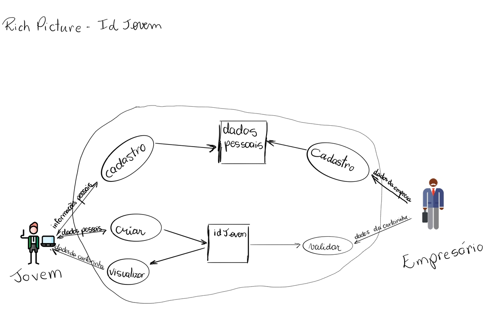
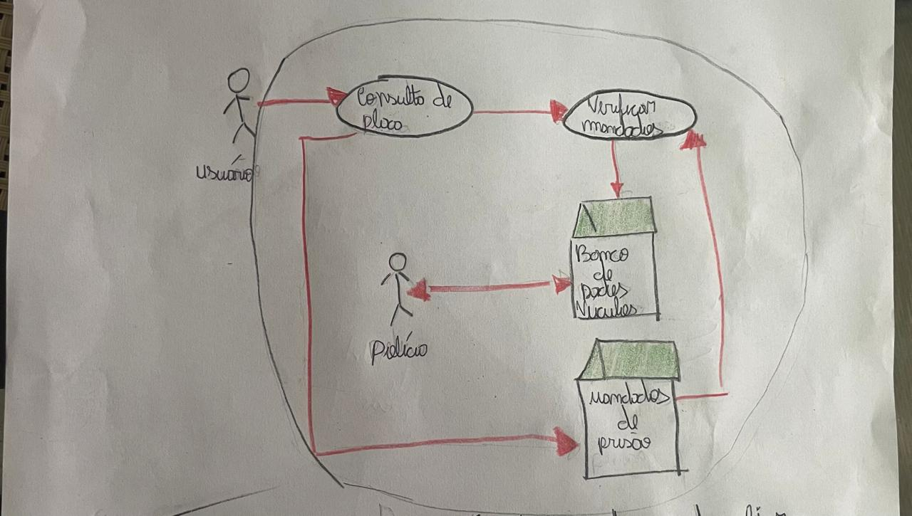
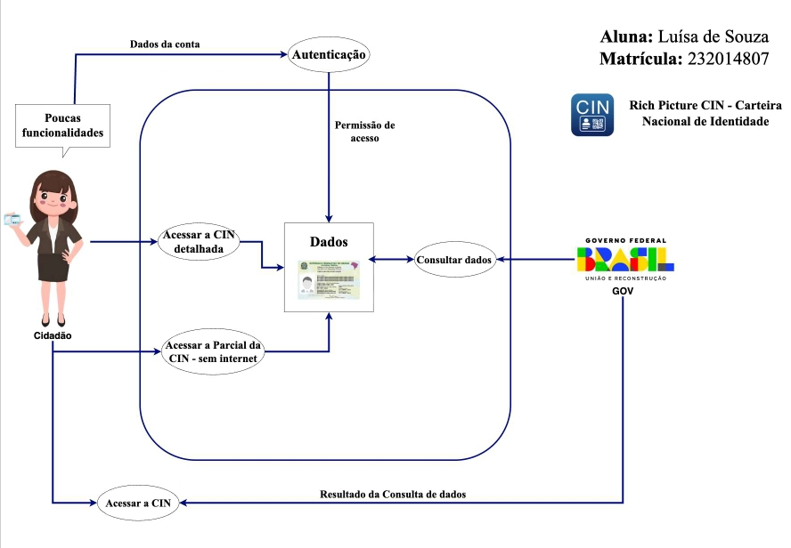
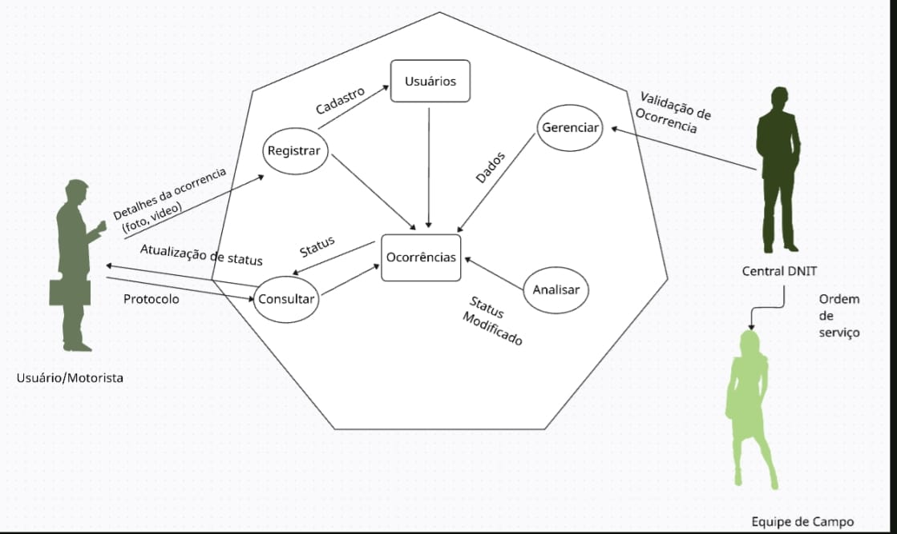
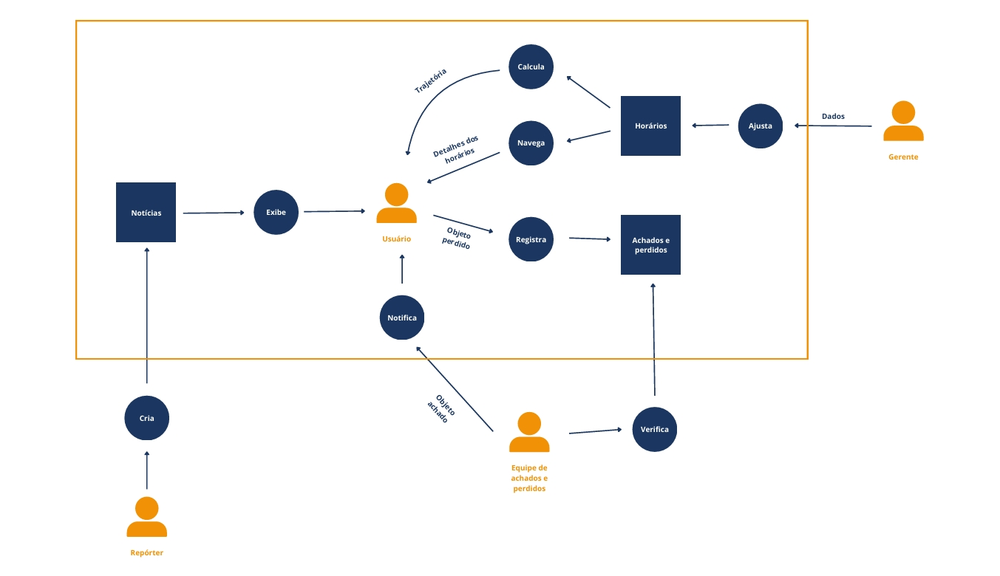

# Aplicativos Analisados

Na primeira fase do projeto, cada estudante teve a oportunidade de escolher individualmente aplicativos governamentais ou de software livre e produzir um Rich Picture inicial com base em sua escolha. Essas propostas foram apresentadas à equipe e discutidas coletivamente, considerando critérios como complexidade, disponibilidade de informações e relevância para o estudo na disciplina de Requisitos de Software.

Os aplicativos inicialmente analisados e seus respectivos Rich Pictures foram:

### ID - Jovem

O ID - Jovem é um aplicativo que conecta jovens a oportunidades de educação, cultura e lazer, facilitando o acesso a programas e benefícios voltados para essa faixa etária.

Figura 1: Richpicture id jovem.

Fonte: [Camila Cavalcante(2025).](https://github.com/CamilaSilvaC)

### FGTS

O FGTS permite que o trabalhador acompanhe de forma prática o saldo e os movimentos do Fundo de Garantia do Tempo de Serviço, trazendo mais transparência e controle sobre seus direitos.

Figura 2: Richpicture fgts.

Fonte: [Geovanna Umbelino(2025).](https://github.com/GeovannaUmbelino)

### Sinesp Cidadão

O Sinesp Cidadão permite a consulta de veículos roubados, pessoas desaparecidas e outras informações importantes para a proteção do cidadão.

Figura 3: Richpicture sinesp cidadão

Fonte: [Lara Mota(2025).](https://github.com/mel14-hub)

### CIN - Carteira Identidade Nacional

O CIN oferece a praticidade de consultar e gerenciar a Carteira de Identidade Nacional digitalmente, facilitando o acesso aos documentos pessoais sem complicações.

Figura 4: Richpicture CIN.

Fonte: [Luísa Ferreira(2025).](https://github.com/luisa12ll)

### Conexão DNIT

O Conexão DNIT mantém os cidadãos informados sobre obras, serviços e condições das rodovias, aproximando a população do trabalho do Departamento Nacional de Infraestrutura de Transportes.

Figura 5: Richpicture conexão dnit.

Fonte: [Pedro Henrique Pereira(2025).](https://github.com/pedrohpsantos) 

### Metro DF

O Metrô DF oferece as informações sobre horários, linhas e serviços do metro de forma simples e acessível.

Figura 6: Richpicture metro DF.

Fonte: [Yan Matheus Aguiar(2025).](https://github.com/Yanmatheus0812)

Após análise e discussão, o grupo decidiu que o aplicativo a ser estudado durante a disciplina seria o HBO Max, considerando sua popularidade, diversidade de funcionalidades e relevância no mercado de streaming. Assim, embora os Rich Pictures iniciais tenham servido como referência, o estudo final do grupo será baseado no HBO Max.

## Histórico de Versões

| Versão   | Data       | Descrição                                | Autor                    | Revisor |
|----------|------------|------------------------------------------|--------------------------|---------|
| 1.0      | 07/09/2025 | Análise inicial dos aplicativos     | [Geovanna Alves](https://github.com/GeovannaUmbelino)           |  [Yan Matheus](https://github.com/Yanmatheus0812)   |
 