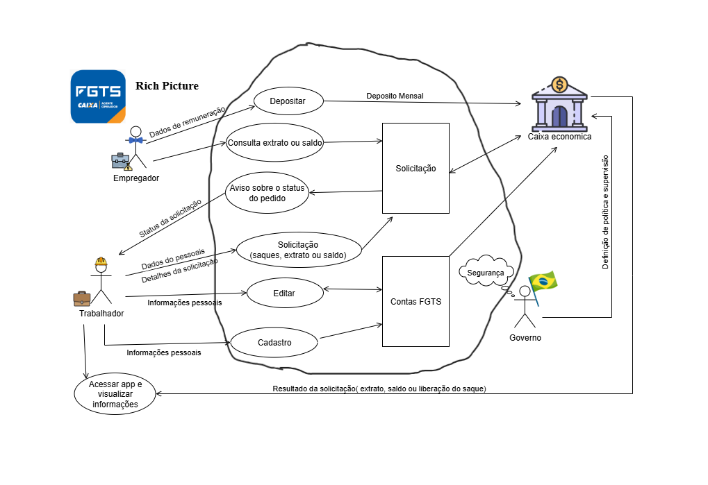

# Aplicativos Analisados

Na primeira fase do projeto, cada estudante teve a oportunidade de escolher individualmente aplicativos governamentais ou de software livre e produzir um Rich Picture inicial com base em sua escolha. Essas propostas foram apresentadas à equipe e discutidas coletivamente, considerando critérios como complexidade, disponibilidade de informações e relevância para o estudo na disciplina de Requisitos de Software.

Os aplicativos inicialmente analisados e seus respectivos Rich Pictures foram:

Figura 1: Richpicture .

Fonte: Camila Silva Cavalcante.

Figura 2: Richpicture FGTS.

Fonte: Geovanna Alves Umbelino.

Figura 3: Richpicture versão 1.

Fonte: Lara .

Figura 4: Richpicture versão 1.

Fonte: Luísa de Souza Ferreira.

Figura 5: Richpicture versão 1.

Fonte: Autores.

Figura 6: Richpicture versão 1.

Fonte: Autores.

Após análise e discussão, o grupo decidiu que o aplicativo a ser estudado durante a disciplina seria o HBO Max, considerando sua popularidade, diversidade de funcionalidades e relevância no mercado de streaming. Assim, embora os Rich Pictures iniciais tenham servido como referência, o estudo final do grupo será baseado no HBO Max.

## Histórico de Versões

| Versão   | Data       | Descrição                                | Autor                    | Revisor |
|----------|------------|------------------------------------------|--------------------------|---------|
| 1.0      | 07/09/2025 | Criação do documento     | Geovanna Alves           | Todos   |
