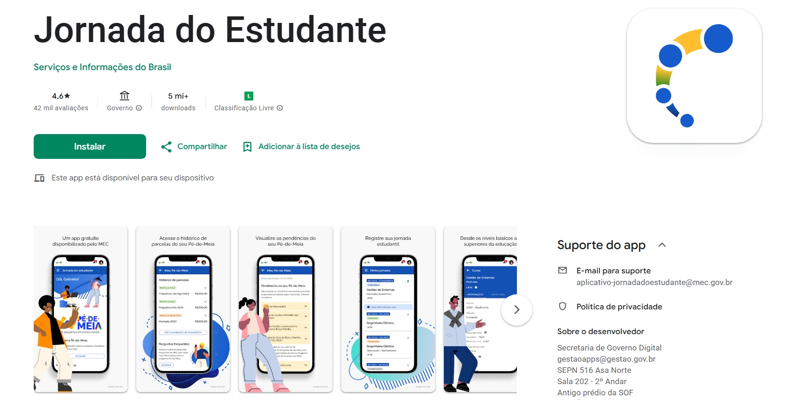

# Aplicativo Selecionado 

## Jornada do Estudante 

**Figura 1 – Logo do Jornada do Estudante **

## Introdução

 
No início da disciplina, cada integrante do grupo apresentou sugestões de aplicativos, acompanhadas de argumentos para justificar suas escolhas. Em seguida, realizamos uma revisão coletiva, utilizando critérios previamente definidos para avaliar cada proposta e chegar a um consenso. Após essa análise e debate, o aplicativo escolhido foi a Jornada do Estudante, por sua relevância no contexto educacional, potencial de impacto social e diversidade de funcionalidades que o tornam adequado para ser estudado nesta disciplina.

## Critérios para escolha
- Aplicativo não ter sido trabalhado anteriormente na disciplina.
- Facilidade de contato com o público-alvo.
- Complexidade do aplicativo.
- Disponibilidade de informações.

## Sobre o Jornada do estudante

 
Jornada do estudante é uma iniciativa do MEC, em parceria com órgãos do Governo Federal, desenvolvida dentro do programa Startup Gov.br. O projeto busca unificar informações acadêmicas dos estudantes ao longo da vida escolar e servir como canal direto de comunicação entre o MEC e a sociedade, alinhado à estratégia de Governo Digital, ao plano nacional de educação e às legislações de acesso à informação e proteção de dados. A jornada do estudante busca facilitar o acesso às políticas educacionais, apoiar a tomada de decisão e promover a inclusão digital, tornando-se um instrumento essencial para a vida acadêmica do estudante no Brasil. A disponibilidade de conteúdos e recursos pode variar por região.
A primeira versão do aplicativo, lançada em junho de 2022, disponibilizou informações acadêmicas para alunos da UTFPR e UFMS, além de serviços digitais e comunicados do MEC para os demais estudantes. Futuras atualizações incluirão outras instituições e níveis de ensino, abrangendo desde a educação básica até a técnica. A interface do aplicativo pode ser observada na Figura 2.

Figura 2 – Aplicativo Jornada do estudante 

Fonte:  [Jornada do estudante na Play Store](https://play.google.com/store/apps/details?id=br.gov.mec.jornada.estudante&hl=pt-BR).

## Termo de Uso

Termo de uso:

## Histórico de Versões

| Versão   | Data       | Descrição                                | Autor(es)                   | Revisor(es) |
|----------|------------|------------------------------------------|--------------------------|---------|
| 1.0      | 07/09/2025 | Seleção dos aplicativos    | Geovanna Alves           | Lara Souza   |
| 1.1      | 09/09/2025 | Adicionando termo de uso     | Geovanna Alves         | Luisa de Souza   |
| 1.2      | 13/09/2025 | Atualização do aplicativo selecionado    | Geovanna Alves    e Luisa de Souza     | Yan Matheus  |

## Bibliografia
[1] Jornada do estudante. Disponível em: [Jornada do estudante na Google Play](https://play.google.com/store/apps/details?id=br.gov.mec.jornada.estudante&hl=pt-BR). Acesso em 19 de setembro de 2025.

