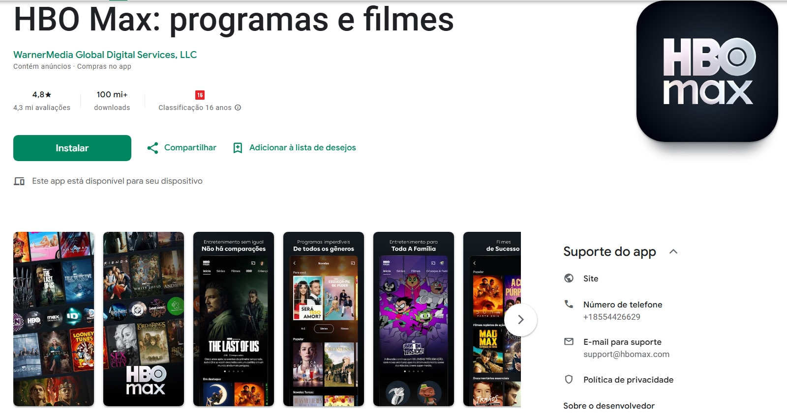

# Aplicativo Selecionado 

## HBO Max

Figura 1 - Logo do HBO Max

## Introdução

 

No início da disciplina, cada integrante do grupo apresentou sugestões de aplicativos, acompanhadas de argumentos que justificavam suas escolhas. Em seguida, realizamos uma revisão coletiva, aplicando critérios definidos para avaliar cada proposta com o objetivo de alcançar um consenso. Após essa análise e um longo debate, o aplicativo selecionado foi o HBO Max, escolhido por sua popularidade, variedade de funcionalidades e relevância no mercado de streaming, características que o tornam uma opção adequada para ser estudada nesta disciplina.

## Critérios para escolha
* Aplicativo não ter sido trabalhado na disciplina
* Facilidade de contato com o público-alvo.
* Complexidade do aplicativo
* Disponibilidade de informações

### Sobre o HBO Max

O HBO Max é uma plataforma de streaming que disponibiliza filmes, séries, documentários, animações e produções originais da HBO e de outras produtoras. O aplicativo permite que os usuários criem perfis personalizados, adicionem conteúdos à lista de favoritos, baixem vídeos para assistir offline e recebam recomendações com base em seu histórico de visualização. Podemos visualizar o aplicativo na *figura 2*

Figura 2 - App HBO Max 

## Termo de uso

## Bibliografia
[1] HBO Max. Disponível em: [HBO Max na Google Play](https://play.google.com/store/apps/details?id=com.hbo.hbonow&hl=pt_BR&gl=US). Acesso em 08 de setembro de 2025.

