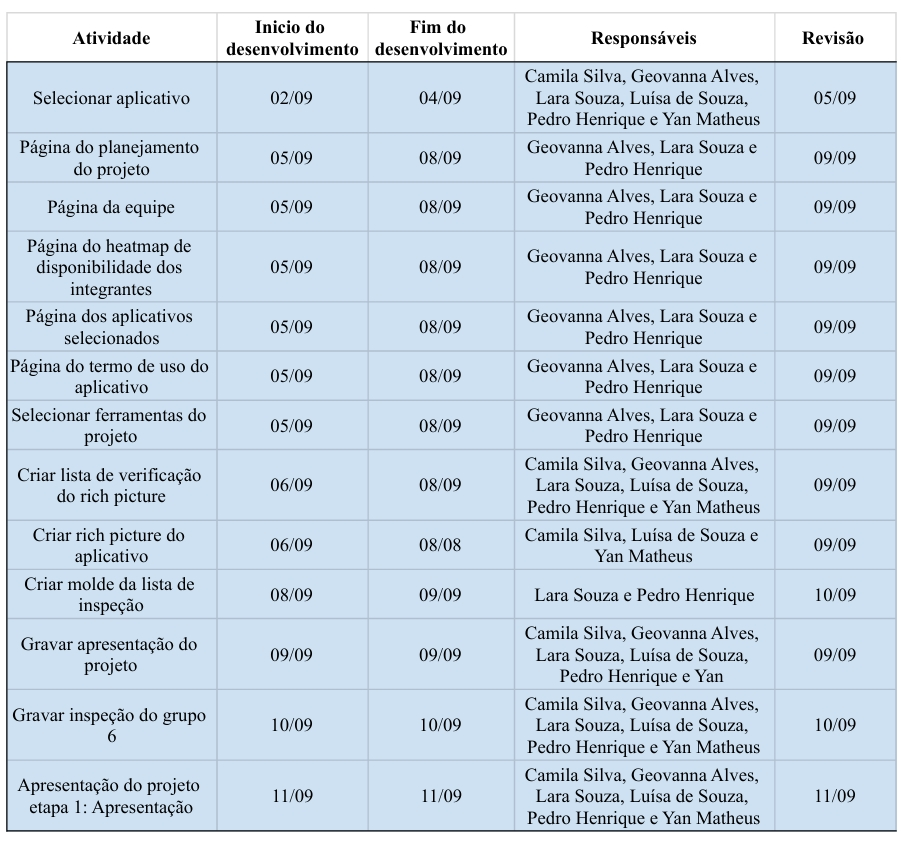
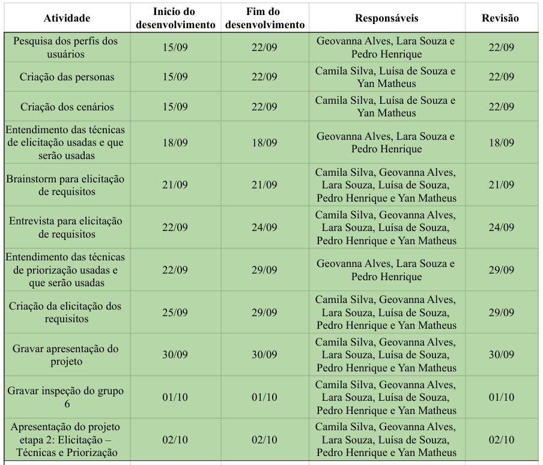
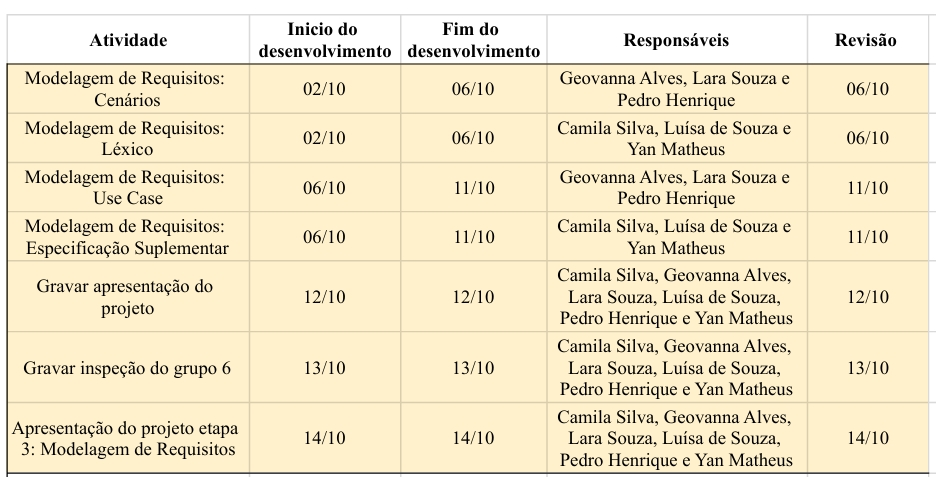
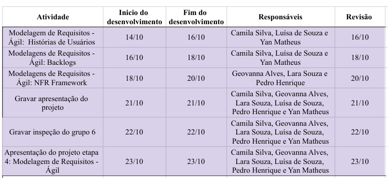
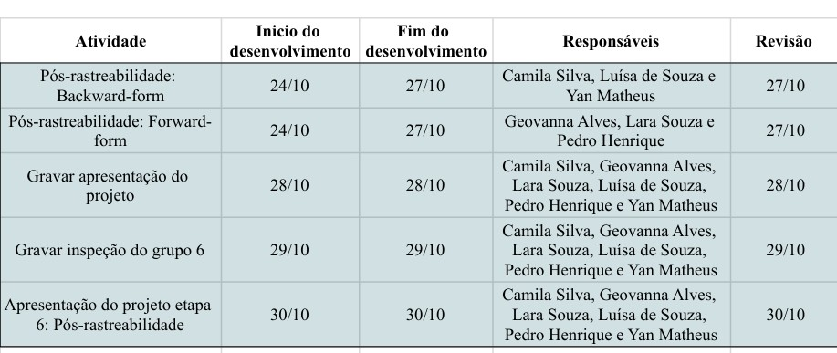
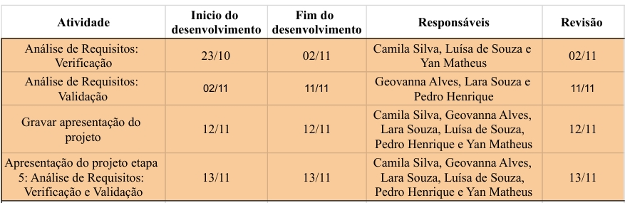

# Cronograma

O cronograma funciona como um instrumento para planejar e distribuir tarefas, recursos e prazos de um projeto de maneira visual, neste caso, por meio de tabelas. Os cronogramas a seguir foram elaborados considerando as datas e prazos estabelecidos no calendário do semestre letivo (2025.2) da disciplina.

## Cronograma Geral 

A _tabela 1_ apresenta todas as atividades e apresentações programadas para o decorrer da disciplina.

| Etapa |             Título             |                       Descrição                       | Entrega | Apresentação |
| :---: | :----------------------------: | :---------------------------------------------------: | :-----: | :----------: |
|   1   |          Planejamento          | Equipe, Definição do App, Planejamento, Rich Picture, Cronagrama, Apps analisados, ferramentas, heatmap. |  09/09  |    11/09     |
|   1.1   |    Inspeção do Grupo + 1     |             Inspeção do Grupo 6 - Planejamento                |  10/09  |   -    |
|   2   |     Elicitação de Requisitos   | Técnicas de elicitação de requisitos, Priorização. |  30/09 |    02/10    |
|   2.1  |   Inspeção do Grupo + 1      |         Inspeção do Grupo 6 - Elicitação de requisitos        |  01/10  |    -     |
|   3  | Modelagem de Requisitos |    Cenários , Léxico, Use Case, Especificação Suplementar.    |  12/10  |    14/10     |
|   3.1   |    Inspeção do Grupo + 1   |       Inspeção do Grupo 6 -  Modelagem de requisitos      |  13/10  |    -   |
|  4   |   Modelagem de Requisitos - Ágil     |               Histórias de Usuário, Backlogs, NFR Framework.               |  21/10  |    23/10     |
|   4.1   |    Inspeção do Grupo + 1   |        Inspeção do Grupo 6 - Modelagem de requisitos Ágil        |  22/10  |    -     |
|   5   |     Pós-Rastreabilidade      |        Gerência de Desenvolvimento de Software        |  28/10  |    30/10     |
|   5.1   |    Inspeção do Grupo + 1     |             Inspeção do Grupo 6 - Pós-Rastreabilidade        |  29/10  |   -    |
|   6   |      Análise de Requisitos    |             Verificação e Validação            |  10/11   |     13/11       |
|   6.1   |    Inspeção do Grupo + 1   |              Inspeção do Grupo 6 - Análise de Requisitos       |  11/12  |   -    |
|   7  |      Projeto Final     |       Entrega e apresentação do Projeto final             |  24/11  |      -       |

_Tabela 1: Cronograma geral de atividades. Fonte: autoria própria._

## Cronograma Específico

 Esta seção apresenta as atividades desenvolvidas ao longo de cada entrega da disciplina.

### Etapa 1  - Planejamento 
A _Figura 1_ aborda as atividades feitas para a primeira entrega.

_Figura 1: cronograma da primeira entrega. Fonte: autoria própria._

### Etapa 2 - Elicitação de Requisitos
A _Figura 2_ aborda as atividades feitas para a segunda entrega.

_Figura 2: cronograma da segunda entrega. Fonte: autoria própria._

### Etapa 3 - Modelagem de Requisitos
A _Figura 3_ aborda as atividades feitas para a terceira entrega.

_Figura 3: cronograma da terceira entrega. Fonte: autoria própria._

### Etapa 4 - Modelagem de Requisitos - Ágil
A _Figura 4_ aborda as atividades feitas para a quarta entrega.

_Figura 4: cronograma da quarta entrega. Fonte: autoria própria._

### Etapa 5 - Pós-Rastreabilidade  
A _Figura 5_ aborda as atividades feitas para a quinta entrega.

_Figura 5: cronograma da quinta entrega. Fonte: autoria própria._

### Etapa 6 - Análise de Requisitos 
A _Figura 6_ aborda as atividades feitas para a sexta entrega.

_Figura 6: cronograma da sexta entrega. Fonte: autoria própria._

### Etapa 7 - Projeto Final

## Histórico de Versões

| Versão | Data       | Descrição                   | Autor             | Revisor         |
|--------|------------|-----------------------------|-------------------|-----------------|
| 1.0    | 08/09/2025 | Criação da página           |  Geovanna Alves   |    Todos        |

## Bibliografia

SALES, A. B. Plano_de_Ensino RE 2025.02 Turma 3. Aprender3. Disponível em: https://aprender3.unb.br/pluginfile.php/3210494/mod_resource/content/66/FGA0313%20-%20T03%20Assinado.pdf. Acesso em 08 de setembro de 2025.