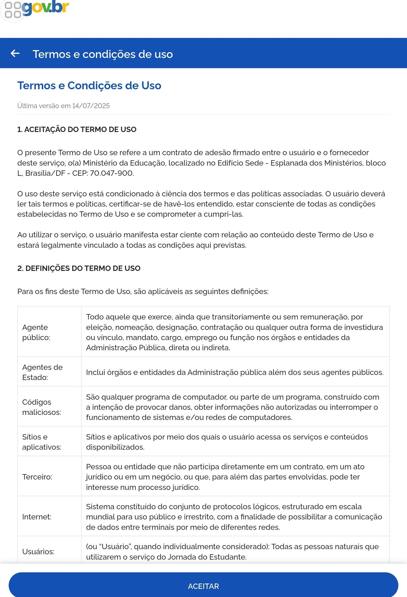
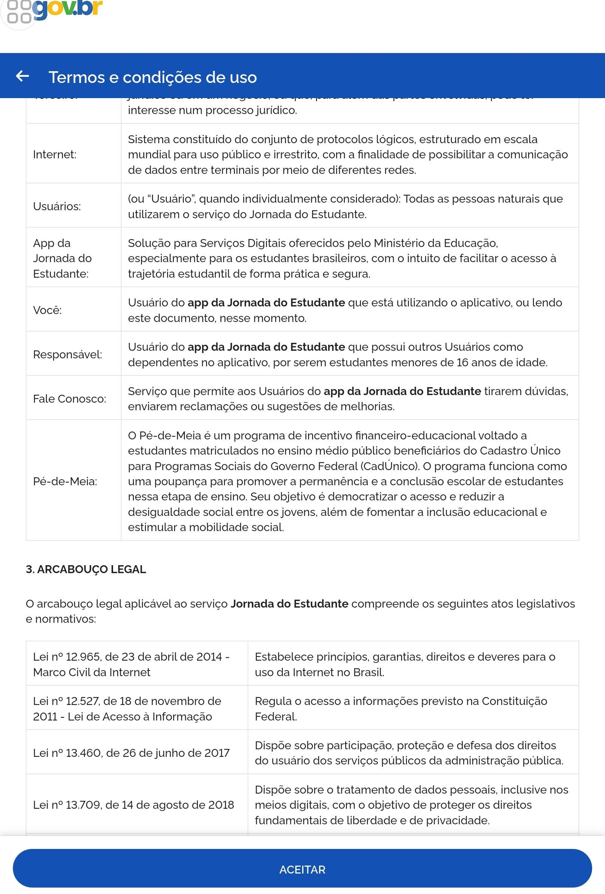
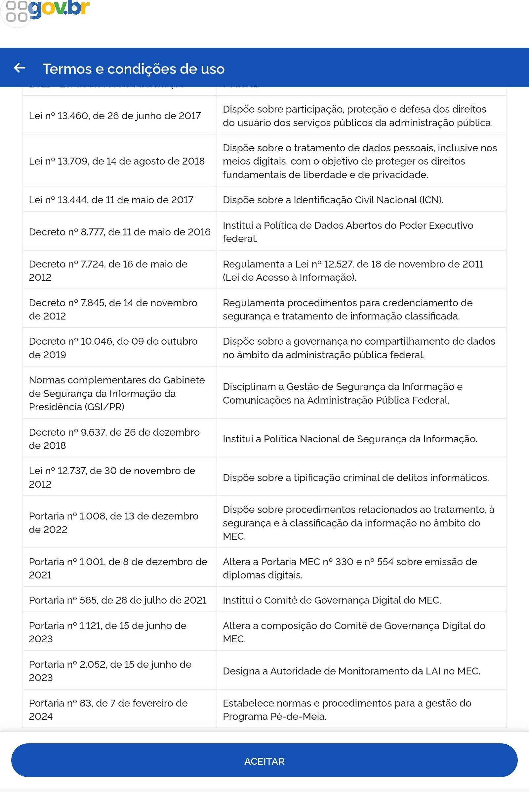
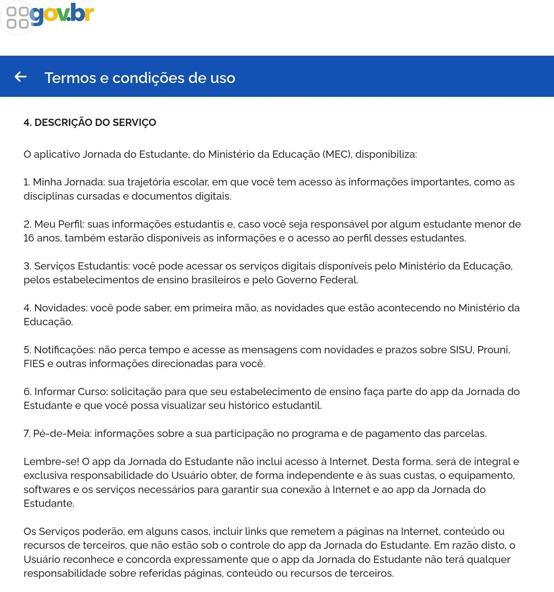
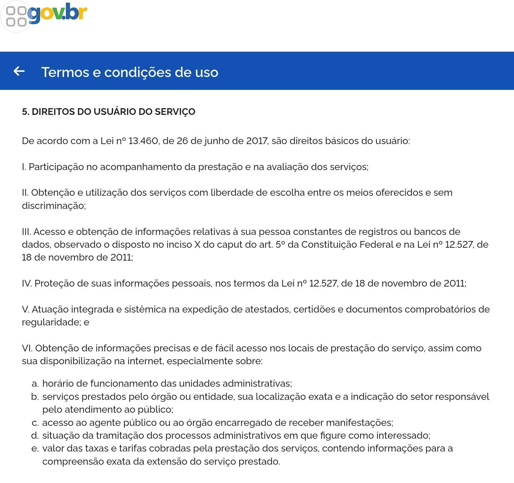
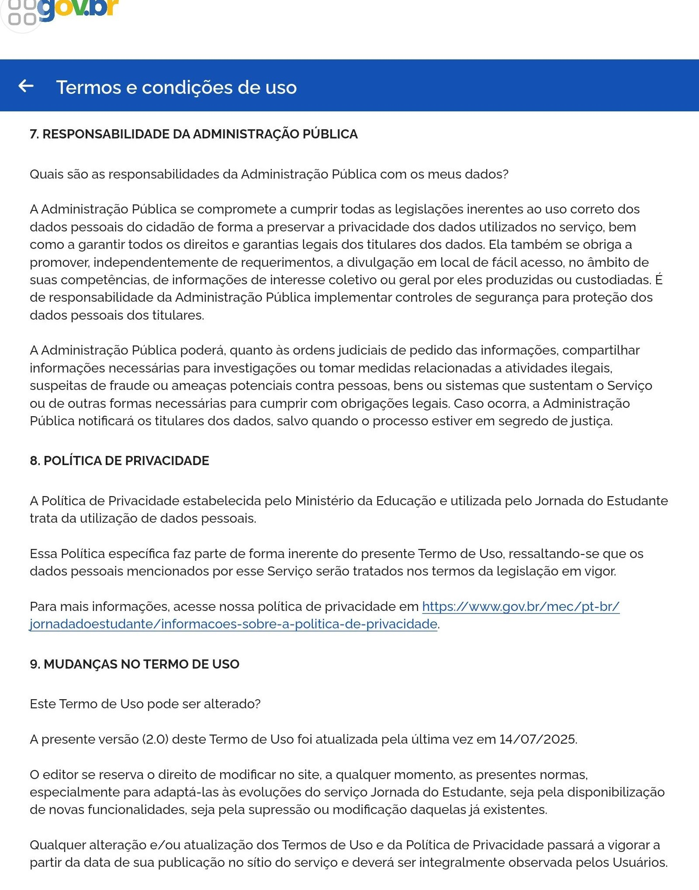
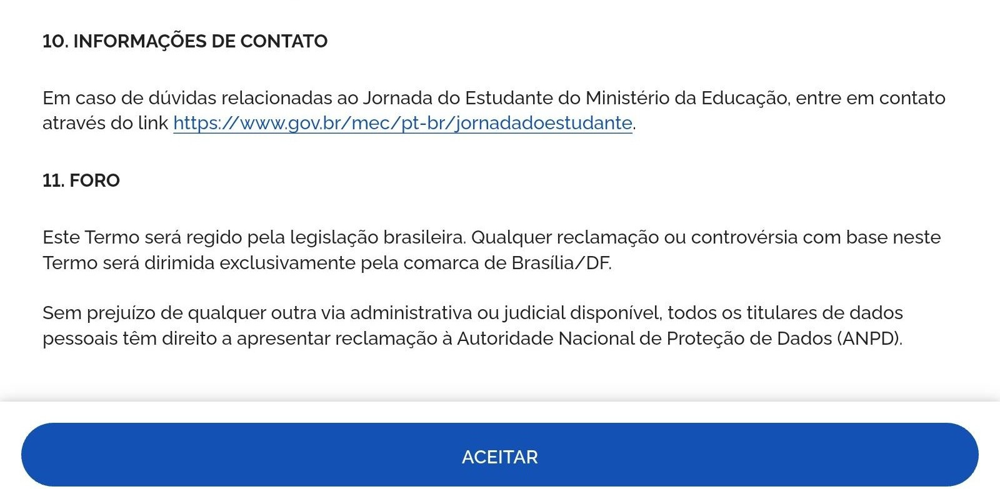

# Termo de Uso

O conteúdo apresentado nesta seção é uma reprodução fiel do documento original, preservado em sua totalidade para garantir a autenticidade das informações e a transparência da análise. Ele foi utilizado como base para um estudo prático dentro do contexto de análise de requisitos em projetos de software<a id="anchor_1" href="#FRM1">[1]</a>.

Vale destacar que este termo de uso foi retirado diretamente da página oficial do aplicativo Jornada do Estudante, disponível no playstore.

Figura 1 – Termo de uso do aplicativo do jornada de estudante. Fonte: [Aplicativo do Jornada do estudante](https://play.google.com/store/apps/details?id=br.gov.mec.jornada.estudante&hl=pt-BR).

Figura 2 – Termo de uso do aplicativo do jornada de estudante. Fonte: [Aplicativo do Jornada do estudante](https://play.google.com/store/apps/details?id=br.gov.mec.jornada.estudante&hl=pt-BR).

Figura 3 – Termo de uso do aplicativo do jornada de estudante. Fonte: [Aplicativo do Jornada do estudante](https://play.google.com/store/apps/details?id=br.gov.mec.jornada.estudante&hl=pt-BR).

Figura 4 – Termo de uso do aplicativo do jornada de estudante. Fonte: [Aplicativo do Jornada do estudante](https://play.google.com/store/apps/details?id=br.gov.mec.jornada.estudante&hl=pt-BR).

Figura 5 – Termo de uso do aplicativo do jornada de estudante. Fonte: [Aplicativo do Jornada do estudante](https://play.google.com/store/apps/details?id=br.gov.mec.jornada.estudante&hl=pt-BR).

Figura 6 – Termo de uso do aplicativo do jornada de estudante. Fonte: [Aplicativo do Jornada do estudante](https://play.google.com/store/apps/details?id=br.gov.mec.jornada.estudante&hl=pt-BR).

Figura 7 – Termo de uso do aplicativo do jornada de estudante. Fonte: [Aplicativo do Jornada do estudante](https://play.google.com/store/apps/details?id=br.gov.mec.jornada.estudante&hl=pt-BR).

Figura 8 – Termo de uso do aplicativo do jornada de estudante. Fonte: [Aplicativo do Jornada do estudante](https://play.google.com/store/apps/details?id=br.gov.mec.jornada.estudante&hl=pt-BR).

## Histórico de Versões

| Versão | Data       | Descrição                            | Autor(es)                                                                                              | Revisor(es)                                     |
| ------ | ---------- | ------------------------------------ | ------------------------------------------------------------------------------------------------------ | ----------------------------------------------- |
| 1.0    | 16/09/2025 | Transcrição da tabela de ferramentas | [Geovanna Alves](https://github.com/GeovannaUmbelino) e [Luisa de Souza](https://github.com/luisa12ll) | [Camila Silva](https://github.com/CamilaSilvaC) |

## Agradecimentos

  Queremos agradecer o <b>Gemini e ChatGPT</b>, ferramenta de Inteligência Artificial Generativa, pelo apoio durante o desenvolvimento deste projeto Jornada do Estudante. Sua ajuda foi essencial na revisão de textos, na organização das ideias e na pesquisa de conteúdos complementares que contribuíram para deixar nossa documentação mais clara e completa.

De acordo com o Código de Conduta da Sociedade Brasileira de Computação (SBC), destacamos que a ferramenta foi utilizada apenas como apoio técnico e linguístico.
Todo o conteúdo apresentado é de autoria do Grupo 04, que assume total responsabilidade por sua originalidade e precisão.

## Bibliografia

<a id="FRM1" href="#anchor_1">1.</a> Aplicativo Jornada do estudante. Disponível em: [Jornada do estudante na Google Play](https://play.google.com/store/apps/details?id=br.gov.mec.jornada.estudante&hl=pt-BR). Acesso em 15 de setembro de 2025.
