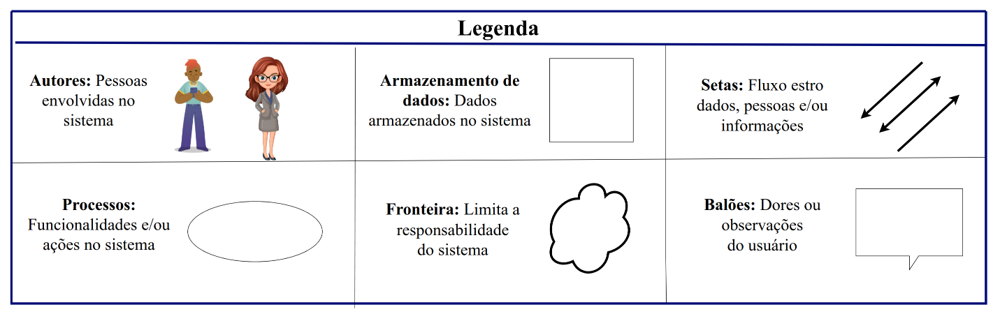

# Rich Picture

## Introdução

As Rich Pictures são representações visuais que ilustram os principais elementos de uma situação e seus relacionamentos. Elas podem ser utilizadas tanto para apoiar a compreensão de um contexto quanto para identificar pontos de melhoria. Na prática, consistem em uma combinação de imagens, textos, símbolos e ícones organizados de forma integrada.

No caso da Jornada do Estudante, a Rich Picture representa a plataforma, suas principais funcionalidades e a forma como os usuários interagem com seus recursos.

## Parrticipantes

A seguir temos a tabela 1, onde indica todos os participantes da criação do Rich picture, o horário e local.

  <table>
    <thead>
      <tr>
        <th>Nome</th>
        <th>Data</th>
        <th>Hora</th>
        <th>Local</th>
      </tr>
    </thead>
    <tbody>
      <tr>
        <td><a href="https://github.com/Yanmatheus0812">Yan Matheus</a></td>
        <td>13/09/2025</td>
        <td>21:00</td>
        <td>Reunião no Teams</td>
         </tr>
      <tr>
        <tr>
        <td><a href="https://github.com/luisa12ll">Luísa de Souza</a></td>
         <td>13/09/2025</td>
        <td>21:00</td>
        <td>Reunião no Teams</td>
      </tr>
    </tbody>
  </table>

Tabela 1: Participante
Autor: [Yan Matheus](https://github.com/Yanmatheus0812)

<iframe width="560" height="315" src="https://www.youtube.com/embed/v6Cmgz2QPM0?si=0htjRtZDmzKkYCdD" title="YouTube video player" frameborder="0" allow="accelerometer; autoplay; clipboard-write; encrypted-media; gyroscope; picture-in-picture; web-share" referrerpolicy="strict-origin-when-cross-origin" allowfullscreen></iframe>

## Metodologia e Ferramentas

A ferramenta Draw.io foi fundamental para a elaboração de elementos visuais-chave do projeto. Com ela, criamos o Rich Picture e sua legenda correspondente. Esses diagramas, mostrados na Figura 1 e Figura 2, são essenciais para uma visão completa do escopo e do contexto do nosso trabalho.

Figura 1: Richpicture versão 1.

Fonte: [Luísa de Souza](https://github.com/luisa12ll) e [Yan Matheus](https://github.com/Yanmatheus0812).

### Legenda

A construção das Rich Pictures foi elaborada com base em cinco elementos principais, conforme destacado por Revadi (2018, p. 4): atores, operações, armazenamentos de dados, setas e o limite do sistema. Esses elementos, essenciais para a representação do contexto do projeto, podem ser observados na _Imagem 2_

Figura 1: Legenda versão 1.

Fonte: [Luísa de Souza](https://github.com/luisa12ll) e [Yan Matheus](https://github.com/Yanmatheus0812).

## Agradecimentos

  Com agradecimentos à <b>Inteligência Artificial(IA)</b> pela contribuição no desenvolvimento deste projeto.

## Bibliografia

> David Benyon. Interação Humano-Computador. São Paulo, v2.0, Pearson Prentice Hall, 2011. "Software requirements", Breakdown topics for software requirements, Capítulo Software Development Project, Introducing Rich Pictures

## Histórico de Versões

| Versão | Data       | Descrição                                     | Autor                                                                                             | Revisor                                            |
| ------ | ---------- | --------------------------------------------- | ------------------------------------------------------------------------------------------------- | -------------------------------------------------- |
| 1.0    | 07/09/2025 | Elaboração do Rich picture do aplicativo      | [Geovanna Alves](https://github.com/GeovannaUmbelino)                                             | [Pedro Henrique](https://github.com/pedrohpsantos) |
| 1.1    | 13/09/2025 | Elaboração do Rich picture do novo aplicativo | [Luisa de Souza](https://github.com/luisa12ll) e [Yan Matheus](https://github.com/Yanmatheus0812) | [Pedro Henrique](https://github.com/pedrohpsantos) |
| 1.2    | 03/10/2025 | Adição da tabela de validação                 | [Yan Matheus](https://github.com/Yanmatheus0812)                                                  | [Camila Silva](https://github.com/CamilaSilvaC)    |
